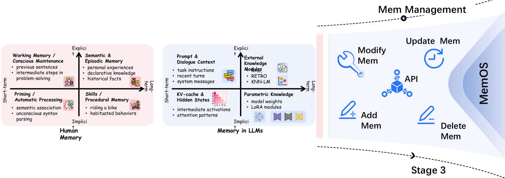

## 2Memory in Large Language Models

Research into LLM memory has progressed through three major stages (see Figure1).

The first is theMemory Definition and Explorationstage, in which researchers classify and analyze memory mechanisms along dimensions such as parametric vs. non-parametric and short-term vs. long-term memory[7,30,23]. For implicit memory, pre-training and adapter-based methods embed knowledge directly into model weights, while knowledge editing techniques enable targeted post hoc modifications[5,1,14,24,26,19,2,32,9]. KV-caches and hidden states constitute the core ofimplicit short-term memory, preserving contextual continuity and guiding generation behavior during inference[6,16,25,28,27]. Explicit short-term memory typically involves prompt concatenation within the context window, but remains limited by context length constraints[21,18]. Explicit long-term memory leverages external retrieval mechanisms, increasingly adopting structured formats—such as graphs and trees—to improve semantic integration and retrieval efficiency[15,8,31,35].

The second stage involves theEmergence of Human-like Memory, where systems optimized for long-term persistence, context awareness, and self-reflection begin to exhibit structural and behavioral patterns reminiscent of human memory. Examples include brain-inspired architectures such as HippoRAG and Memory3[12,34], as well as systems like PGRAG and Second-Me[17,29], which support behavior continuity and personalized memory modeling.

The third stage advances towardSystematic Memory Management, integrating tool-based operations with OS-inspired governance frameworks. This includes toolkits such as EasyEdit and Mem0, which support explicit memory manipulation[36,33,4], as well as systems like Letta[22], which implement paged context management and modular invocation. However, these systems still fall short of providing unified scheduling, lifecycle governance, and memory fusion across roles or agents.