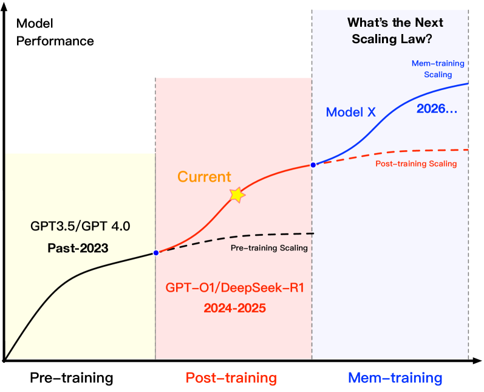

## 3MemOSDesign Philosophy

As AGI continues to evolve into increasingly complex systems characterized by multi-tasking, multi-role collaboration, and multi-modality, language models must move beyond merely “understanding the world”—they must also “accumulate experience,” “retain memory,” and “continuously evolve.” However, prevailing architectures remain anchored in static parameters and lack structured modeling and unified management of memory, rendering them inadequate for supporting knowledge updates, state retention, and personalized adaptation. We propose that treating memory as a first-class resource and building a memory-centric execution paradigm is key to enabling continual adaptation and long-term reasoning in future LLMs.

As shown in Figure2, traditional scaling laws are approaching diminishing returns. The research paradigm is shifting from data- and parameter-centric pretraining to post-training paradigms focused on alignment and fine-tuning. Yet even this refined approach faces dual challenges: diminishing performance gains and increasing engineering complexity. We posit that the next fundamental leap will arise from the ability to continuously model and schedule memory—enabling LLMs to maintain contextual consistency, adapt to evolving knowledge, and support iterative refinement across tasks.

To this end, we introduceMemOS—a prototype system designed to support a newmemory-centric training paradigm, where learning and inference are no longer separate phases but part of a unified, memory-driven process.MemOSnot only enables structured memory storage, interface-level invocation, and lifecycle management, but also provides unified scheduling and version control mechanisms that constitute the foundational infrastructure for sustainable intelligence evolution. In our design vision,MemOStreats memory as a schedulable core resource, breaking down silos between agents, users, applications, and sessions. It adoptsevolutionas a central management objective—supporting memory recomposition, migration, and fusion to facilitate long-term capability growth. Simultaneously,governanceis a foundational pillar:MemOSintegrates access control, traceability, and interpretability mechanisms to ensure safe and compliant model operation in complex environments.