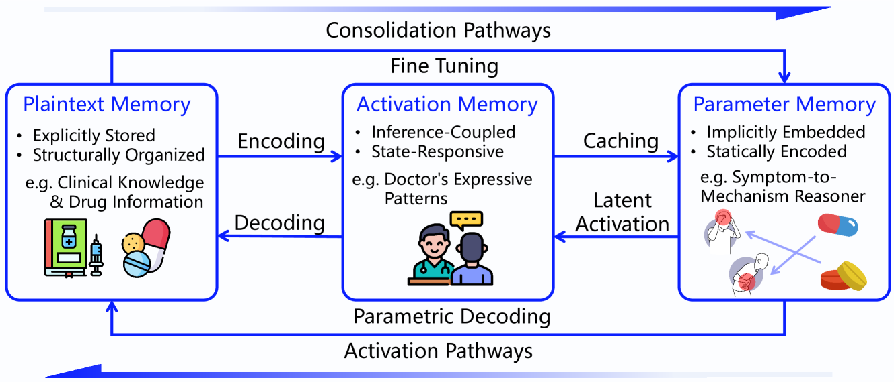
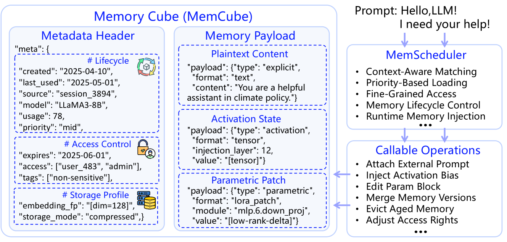
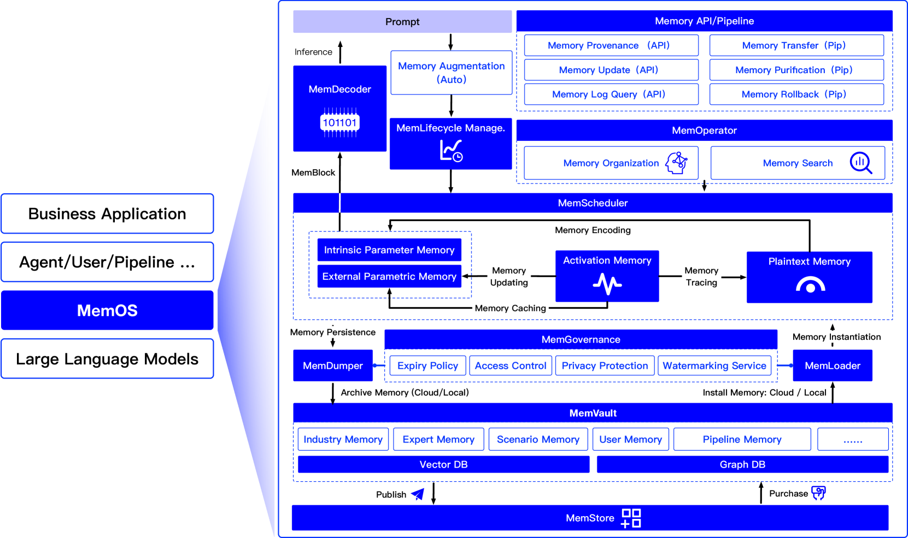
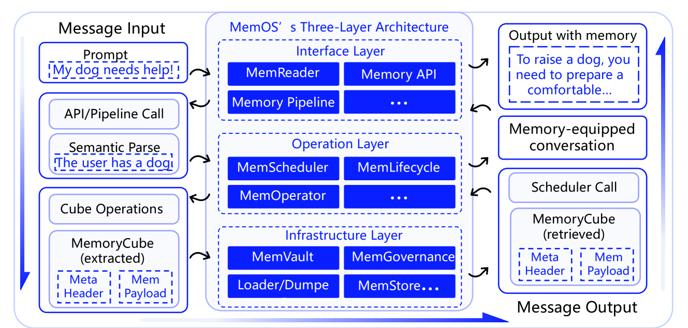

## 4MemOS

### 4.1Types of Memory inMemOS

InMemOS, memory is not merely a container of knowledge, but serves as the continuous substrate for perception, understanding, and action within the model. To systematically support LLMs in evolving across diverse tasks and scenarios,MemOSclassifies memory into three core types:Parametric Memory,Activation Memory, andPlaintext Memory. Each type differs in its representation, lifecycle, and invocation mechanism, collectively forming the multi-layered structure of an intelligent agent’s cognitive system.

Parametric Memoryrefers to long-term knowledge encoded directly into model weights through pretraining or fine-tuning, embedded within feedforward and attention layers. It can participate in inference without the need for external retrieval. This memory type underpins fundamental language understanding, general knowledge, and skill modules—serving as the backbone for zero-shot generation and capability-driven agents. InMemOS, parametric memory includes not only foundational language capabilities but also supports modular, domain-specific injection—such as legal or medical knowledge—via pluggable LoRA-based modules for efficient composition and reuse.

Activation Memorydenotes the transient cognitive state generated during inference, including hidden layer activations, attention weights, and KV-cache structures. It plays a critical role in context awareness, instruction alignment, and behavior modulation.MemOStreats activation memory as a “working memory” layer, enabling dynamic scheduling for tasks such as context persistence, stylistic control, and behavioral supervision. Frequently accessed activation states—such as KV-caches or attention patterns—can be transformed into semi-structured fragments or parametric modules, allowing short-term memory to persist and evolve over time.

Plaintext Memorycomprises explicit knowledge retrieved from external sources, characterized by properties such as editability, shareability, and governance compatibility. Typical formats include documents, knowledge graphs, and prompt templates. This memory type addresses the limitations of context window size and fixed parameters, enabling rapid knowledge updates, personalized injection, and multi-agent collaboration. InMemOS, plaintext memory contributes to inference context generation and supports versioning, access control, and invocation tracing—serving as the foundation of knowledge governance.

These three types of memory are unified under a standard operational abstraction inMemOS: theMemory Cube (MemCube), which supports cross-type scheduling, lifecycle management, and structured fusion. By enabling transformation pathways between memory types (e.g., Activation→→\rightarrow→Plaintext, Plaintext→→\rightarrow→Parametric),MemOSestablishes a scalable memory runtime that elevates LLMs from mere language generators to memory-enabled, adaptive, and continually evolving agents.

### 4.2Memory Cube (MemCube) as a Core Resource

InMemOS, the key to unifying and evolving heterogeneous memory resources lies in standardizing their representation and management mechanisms. To this end, we introduceMemCubeas the system’s fundamental encapsulation unit (see Figure4). The memory resources of LLMs span parametric knowledge, KV-caches, and externally injected content—each differing in origin, lifecycle, and invocation semantics.MemCubeunifies these heterogeneous forms through a consistent data structure and interface, encapsulating both a semantic payload and structured metadata to enable uniform scheduling, access control, and lifecycle governance.MemCubemetadata is organized into three categories to support memory identification, control, and evolution:

#### Descriptive Metadata

Used to identify the memory unit and define its semantic role. This includes timestamps (for creation or updates), origin signatures (e.g., user input, inference output), and semantic types (e.g., user preference, task prompt, domain knowledge).

#### Governance Attributes

Enable safe and controlled usage in multi-user environments. These include access permissions, lifespan policies (e.g., time-to-live or frequency-based decay), priority levels, and compliance mechanisms such as sensitivity tags, watermarking, and access logging.

#### Behavioral Indicators

Capture runtime usage patterns—automatically collected metrics such as access frequency, context relevance, and version lineage—that inform dynamic scheduling and cross-type transformation. This mechanism supports automatic adaptations, such as:

- •Plaintext⇒⇒\Rightarrow⇒Activation: Frequently accessed plaintext memory is converted into activation templates to reduce re-decoding costs;
- •Plaintext/Activation⇒⇒\Rightarrow⇒Parametric: Stable, reusable knowledge is distilled into parametric structures to boost inference efficiency;
- •Parametric⇒⇒\Rightarrow⇒Plaintext: Rarely used or outdated parameters are externalized into editable plaintext for greater flexibility.

Plaintext⇒⇒\Rightarrow⇒Activation: Frequently accessed plaintext memory is converted into activation templates to reduce re-decoding costs;

Plaintext/Activation⇒⇒\Rightarrow⇒Parametric: Stable, reusable knowledge is distilled into parametric structures to boost inference efficiency;

Parametric⇒⇒\Rightarrow⇒Plaintext: Rarely used or outdated parameters are externalized into editable plaintext for greater flexibility.

With contextual fingerprinting and policy-aware scheduling, the system enables on-demand activation, hierarchical caching, and structural evolution—makingMemCubea self-aware and continuously adaptive memory unit.

### 4.3MemOSArchitecture

To support unified and adaptive memory handling in LLMs, provides an execution framework for memory parsing, scheduling, and governance. As shown in Figure5, it manages the full memory lifecycle via theMemoryCubeabstraction.MemOSadopts a modular three-layer architecture, forming a closed-loop memory governance framework across the Interface Layer, Operation Layer, and Infrastructure Layer (see Figure6).

TheInterface Layerserves as the system entry point, responsible for parsing natural language requests, identifying memory-related intents, and invoking standardized Memory APIs. The built-inMemReadercomponent translates user inputs into structured memory operation chains.
TheOperation Layerfunctions as the central controller, orchestrating components such asMemScheduler,MemLifecycle, andMemOperatorto support task-aware scheduling, lifecycle control, and structural organization across users and workflows.
TheInfrastructure Layerprovides the foundational support for reliable execution, offering memory storage, access control, and cross-platform interoperability through modules such asMemVault,MemGovernance, andMemStore.

#### Interface Layer: Memory API and Pipeline

The Interface Layer is centered around a unifiedMemory API, offering key interfaces includingProvenance API,Update API, andLogQuery API—used respectively for annotating memory sources, updating memory contents, and querying usage traces. All operations are encapsulated within theMemoryCubestructure and governed by access control mechanisms provided throughMemGovernance. To support multi-stage and composable workflows,MemOSintroduces a pipeline-style operation chain mechanism. Each pipeline node transmits context, state, and intermediate outputs viaMemoryCube, enabling transaction control, customizable topologies, and DAG-based scheduling. Developers can construct common operation patterns (e.g., Query–Update–Archive) to enable reuse across multi-model collaboration scenarios and ensure consistent memory operations.

#### Operation Layer: Memory Scheduling and Lifecycle Management

The Operation Layer orchestrates memory scheduling, lifecycle evolution, and organization.MemSchedulerdynamically selects parametric, activation, or plaintext memory based on user-, task-, or organization-level context, supporting pluggable strategies such as least-recently-used (LRU), semantic similarity, and label-based matching.MemLifecyclemodels the memory lifecycle as a state machine and supports version rollback and freezing mechanisms to ensure auditability and temporal consistency.MemOperatormanages memory through tagging systems, graph-based structures, and multi-layer partitions, enabling hybrid structural and semantic search. Retrieved results are linked back toMemSchedulerto determine activation paths. Frequently accessed memory entries are cached at an intermediate layer to optimize performance. Collectively, these components enable effective structuring, precise invocation, and robust reasoning across tasks and agents.

#### Infrastructure Layer: Governance and Memory Store

The Infrastructure Layer governs memory compliance, storage, and circulation, ensuring system trustworthiness and long-term evolvability.MemGovernanceenforces access permissions, lifecycle policies, and audit trails to ensure secure and accountable memory operations in multi-user environments.MemVaultmanages diverse memory repositories and provides unified access across heterogeneous storage backends.MemLoaderandMemDumperfacilitate structured memory migration across platforms and agents while preserving contextual integrity.MemStoresupports the open publishing and subscription of memory units, enabling multi-model knowledge sharing and collaborative execution.

Overall, the system operates through a closed-loop Memory I/O Path, with all modules interfacing via theMemoryCubeabstraction. It supports view customization, access isolation, and extensibility to future multi-modal scenarios.

### 4.4System Execution Flow

As illustrated in Figure6, aMemOSexecution begins with a user prompt or triggered task, parsed byMemReaderinto a structuredMemory APIcall. This call initiates a pipeline, where context and state are passed viaMemoryCubeunits.MemSchedulerthen selects relevant memory (parametric, activation, or plaintext) based on access patterns and scheduling policies. Retrieved units are injected into the reasoning context.MemOperatororganizes memory semantically and structurally, whileMemLifecyclegoverns state transitions.
Archived memory is persisted inMemVault, managed byMemGovernance, and can be uploaded to or downloaded fromMemStorefor inter-agent collaboration. Migration between agents is supported byMemLoader/MemDumper.
This process forms a closed-loop memory flow—from input to activation, transformation, storage, and reuse—driven by declarative policies and executed through theMemoryCubeabstraction.

