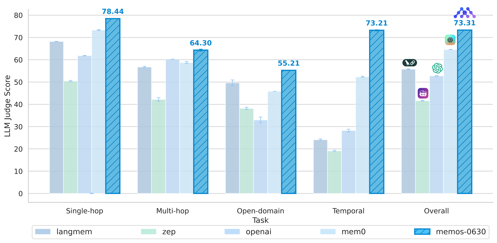
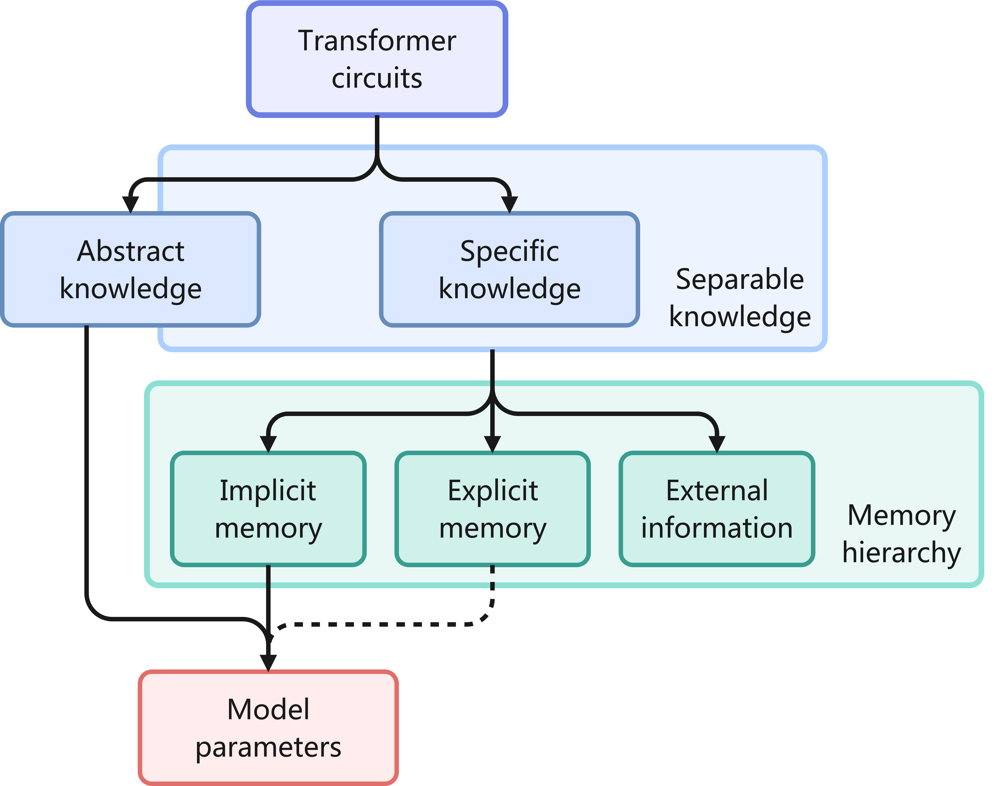

## 1Introduction

With the advent of the Transformer architecture and the maturation of self-supervised pretraining, Large Language Models (LLMs) have become the cornerstone of modern NLP.
Trained on large-scale corpora, LLMs exhibit near-human performance in open-domain QA, text generation, and summarization tasks[2].
With increasing model size and compute, their capabilities have expanded to structured code generation[3], cross-modal reasoning[4], multi-turn dialogue, and complex planning—positioning LLMs as a leading paradigm toward Artificial General Intelligence (AGI).

Looking ahead, the presence of LLMs, or more generally, AGI systems, will expand vastly in both time and space.
Temporally, models will shift from stateless, session-based tools to persistent agents embedded in long-running workflows.
Much like humans, they will need to accumulate interaction histories, adapt internal states, and reason over extended contexts.
Spatially, LLMs are evolving into foundational intelligence layers across users, platforms, and ecosystems.
Whether deployed in cloud services or embedded in enterprise systems, they must support consistency, adaptability, and personalization across users, roles, and tasks.
As such omnipresence becomes the norm, a critical challenge emerges: how should knowledge be organized, stored, and retrieved?

With expanding interaction histories, models face a potentially unbounded context space.
We anticipate that future LLMs will seek to leverage as much of their accessible temporal and spatial context as possible, to support deeper reasoning, decision-making, and adaptation.
No longer reprocessing all past information per inference, they will decide what to retain, compress, discard, or prioritize.
In this always-on paradigm, memory becomes a necessity, not an add-on, for maintaining coherent behavior and identity over time.
This requires efficient management of large-scale, multi-source information and dynamic scheduling of memory conditioned on context.
This motivates a layered memory hierarchy, similar to how OSs manage memory, consisting of working memory, long-term storage, and cold archives, governed by recency, access frequency, and importance.
Sharing memory across users and agents requires scoping, permission control, and migratable, reusable representations.
These capabilities are vital not only for system efficiency, but for the long-term sustainability of model-based knowledge evolution.

The management of memory will become model-defined instead of human-defined.
Just as deep learning replaced feature engineering, the transition of memory management from hard-coded pipelines (e.g., RAG) to learnable strategies is natural and necessary.
Future agents will autonomously decide whether to retrieve memory, summarize interaction into reusable rules, abstract preferences, or transfer knowledge across contexts.
In essence, models must take on the responsibility of shaping their own memory architectures and strategies.
Yet, existing infrastructures fall short of enabling this shift.

Mainstream LLMs rely on implicitparameter memory, encoding knowledge in billions or trillions of model weights.
While this approach affords generalization, it suffers from high update cost, poor interpretability, and limited flexibility.
Retraining or fine-tuning requires significant computational resources and risks issues such as catastrophic forgetting.

To address this bottleneck, Retrieval-Augmented Generation (RAG) has emerged as a popular augmentation strategy.
By incorporating external retrieval modules, RAG allows models to dynamically access fresh information at inference time, enabling augmentation without parameter updates[5,6,7,8,9,10,11].
It is now widely deployed in systems such as Copilots[12]and enterprise search[13,14,15,16].
Nonetheless, RAG remains fundamentally an “on-the-fly retrieval and transient composition” pipeline, rather than an integrated memory management system.
It lacks core memory manageability features such as lifecycle tracking, versioning, and permission-aware scheduling, limiting its ability to support long-term, adaptive knowledge systems.
As a result, models continue to exhibit short-memory behavior in multi-turn dialogue, planning, and personalization tasks, struggling to maintain behavioral consistency or long-horizon adaptation.

Recent work has shown that the limitations of current memory mechanisms are not incidental, but stem from the architectural absence of explicit and hierarchical memory representations within LLMs.
For example,[1]argues that without an intermediate explicit memory layer bridging external retrieval and parametric storage, models become suboptimal in terms of read-write cost, and cannot balance storage cost against retrieval efficiency.
This distinction is illustrated in Figure2, which categorizes knowledge and memory formats and highlights the intermediate role of explicit memory.

From a systems perspective, neither parametric memory nor RAG treats memory as a schedulable and evolvable system resource.
This structural gap remains a core bottleneck preventing LLMs from becoming persistent and collaborative intelligent agents.
As application scenarios grow more complex, these limitations become particularly evident in the following four typical contexts.

- •Long-range Dependency Modeling: As tasks and dialogues grow in length, models must preserve instruction and state consistency across multiple turns or stages.
However, current Transformer architectures face three major obstacles: limited context windows constrain input capacity, quadratic attention cost leads to high compute overhead, and user instructions often detach from model behavior over long horizons.
For example, in complex tasks, user-defined code structures or writing styles are frequently forgotten, and model outputs revert to default modes.
As LLMs are deployed in multi-turn dialogue, long-form generation, and persistent workflows, long-context—and even infinite-context—will become a general requirement rather than a rare exception.
This limitation indicates the lack of mechanisms for persistent state maintenance and structured context retention.
- •Adapting to Knowledge Evolution: Real-world knowledge evolves continuously (e.g., legal updates, scientific discoveries, current events), but static parameters prevent timely reflection. RAG allows dynamic retrieval, yet remains a stateless patching mechanism lacking unified versioning, provenance, or temporal awareness. For instance, it may cite outdated and new regulations simultaneously without reconciliation. It cannot retire obsolete facts, prioritize reliable ones, or track knowledge evolution—limiting long-term consistency.
- •Personalization and Multi-role Support: LLMs lack durable “memory traces” across users, roles, or tasks. Each session resets to a blank state, ignoring accumulated preferences or styles. Although tools like ChatGPT and Claude now offer memory, issues persist: capacity limits, unstable access, opaque updates, and missing editability. Current systems emphasize passive recording over structured control, making them ill-suited for long-term personalization across diverse use cases.
- •Cross-platform Memory Migration and Ecosystem Diversity: As LLMs expand from single interfaces to multi-end deployments (web, mobile, enterprise), user memories (e.g., profiles, task history, preferences) should persist across contexts. Yet most systems trap memory within specific instances, forming “memory islands.” For example, ideas explored in ChatGPT[17]can’t carry over to Cursor[18], forcing context rebuilding. This impairs continuity and blocks memory reuse. Deeper yet, centralization vs. decentralization poses a systemic challenge: while monopolized platforms benefit from feedback loops, distributed models risk stagnation. Making memory portable and reusable is key to balancing evolution efficiency with ecosystem diversity.

Long-range Dependency Modeling: As tasks and dialogues grow in length, models must preserve instruction and state consistency across multiple turns or stages.
However, current Transformer architectures face three major obstacles: limited context windows constrain input capacity, quadratic attention cost leads to high compute overhead, and user instructions often detach from model behavior over long horizons.
For example, in complex tasks, user-defined code structures or writing styles are frequently forgotten, and model outputs revert to default modes.
As LLMs are deployed in multi-turn dialogue, long-form generation, and persistent workflows, long-context—and even infinite-context—will become a general requirement rather than a rare exception.
This limitation indicates the lack of mechanisms for persistent state maintenance and structured context retention.

Adapting to Knowledge Evolution: Real-world knowledge evolves continuously (e.g., legal updates, scientific discoveries, current events), but static parameters prevent timely reflection. RAG allows dynamic retrieval, yet remains a stateless patching mechanism lacking unified versioning, provenance, or temporal awareness. For instance, it may cite outdated and new regulations simultaneously without reconciliation. It cannot retire obsolete facts, prioritize reliable ones, or track knowledge evolution—limiting long-term consistency.

Personalization and Multi-role Support: LLMs lack durable “memory traces” across users, roles, or tasks. Each session resets to a blank state, ignoring accumulated preferences or styles. Although tools like ChatGPT and Claude now offer memory, issues persist: capacity limits, unstable access, opaque updates, and missing editability. Current systems emphasize passive recording over structured control, making them ill-suited for long-term personalization across diverse use cases.

Cross-platform Memory Migration and Ecosystem Diversity: As LLMs expand from single interfaces to multi-end deployments (web, mobile, enterprise), user memories (e.g., profiles, task history, preferences) should persist across contexts. Yet most systems trap memory within specific instances, forming “memory islands.” For example, ideas explored in ChatGPT[17]can’t carry over to Cursor[18], forcing context rebuilding. This impairs continuity and blocks memory reuse. Deeper yet, centralization vs. decentralization poses a systemic challenge: while monopolized platforms benefit from feedback loops, distributed models risk stagnation. Making memory portable and reusable is key to balancing evolution efficiency with ecosystem diversity.

A review of the four challenges reveals a shared pattern: models lack the ability to coherently manage and coordinate information distributed across time and space.
This is not due to any single failing module, but to the absence of a system-level mechanism for organizing and operating over memory.

Modern LLMs lack an intermediate layer between parametric storage and external retrieval, making it difficult to manage memory lifecycle, integrate evolving knowledge, or maintain behavioral continuity.
While RAG provides access to external information, its lack of unified structure and operational semantics prevents long-term, controllable use of knowledge.

Therefore, we argue that building future-capable language intelligence systems requires treating memory as a system-level resource that can be explicitly modeled and scheduled.
In modern operating systems, computational resources (CPU), storage (RAM/disks), and communication (I/O) are uniformly scheduled and managed across their lifecycle.
In contrast, memory in large model architectures exists as implicit parameters or temporary retrievals—neither schedulable nor traceable, and incapable of integration or transfer.
Therefore, the key to enhancing memory in LLMs is not simply “adding a cache" or “attaching an external retrieval module," but redefining the operational logic and resource management of memory from a systems-level perspective.

To address these challenges, we proposeMemOS(Memory Operating System), a dedicated memory operating system designed for large language models.
The core philosophy ofMemOSis that, in order to fully utilize temporally and spatially distributed information, models require a unified framework for organizing memory, maintaining internal state, and supporting long-term adaptation.

Inspired by recent work on memory hierarchy for improving model efficiency and adaptability[1],MemOSextends this idea into a system-level design by modeling memory as schedulable and evolvable resource units.
It builds a modular architecture around the memory lifecycle—including generation, activation, fusion, archiving, and expiration—supported by components such asMemReader,MemScheduler,MemLifecycle, andMemOperator, which together orchestrate memory flow, state transitions, and access control.

Much like traditional operating systems coordinate CPU, memory, and I/O,MemOSprovides an abstraction layer and unifiedMemory API, enabling consistent and auditable access to memory units across users, tasks, and sessions.
The system supports structured storage, provenance tagging, lifecycle tracking, and fine-grained permission enforcement, forming a scalable foundation for memory-driven reasoning.
More importantly,MemOSlays a cognitive foundation for the next generation of AGI systems with long-term memory and continual evolution, and provides efficient infrastructure for memory-centric architectural innovation.

The system provides three core capabilities:

- •Controllability:MemOSoffers full lifecycle management of memory units, enabling unified scheduling of memory creation, activation, fusion, and disposal. It implements multi-level permission control and context-aware activation strategies, ensuring safety and traceability in multi-task and multi-user environments through access control and operation auditing. For instance, user preference memories can be scoped to specific agent instances and automatically expire or archive after task completion.
- •Plasticity:MemOSsupports memory restructuring and migration across tasks and roles. It provides memory slicing, tagging, hierarchical mapping, and context binding capabilities, allowing developers or systems to construct highly adaptable memory structures based on inference objectives. This enables models to activate different memory views for different tasks or update memory associations dynamically during role transitions, facilitating rapid cognitive adaptation and behavior shaping.
- •Evolvability:MemOSenables dynamic transitions and unified scheduling among different memory types—including parameter memory (knowledge embedded in model weights), activation memory (contextual inference state), and plaintext memory (structured knowledge fragments). The system supports seamless transitions, such as converting user-defined rules from multiple dialogues into active memory, or compressing long-term structured knowledge into parametric form. This cross-memory adaptation provides a robust foundation for knowledge integration, autonomous learning, and model evolution.

Controllability:MemOSoffers full lifecycle management of memory units, enabling unified scheduling of memory creation, activation, fusion, and disposal. It implements multi-level permission control and context-aware activation strategies, ensuring safety and traceability in multi-task and multi-user environments through access control and operation auditing. For instance, user preference memories can be scoped to specific agent instances and automatically expire or archive after task completion.

Plasticity:MemOSsupports memory restructuring and migration across tasks and roles. It provides memory slicing, tagging, hierarchical mapping, and context binding capabilities, allowing developers or systems to construct highly adaptable memory structures based on inference objectives. This enables models to activate different memory views for different tasks or update memory associations dynamically during role transitions, facilitating rapid cognitive adaptation and behavior shaping.

Evolvability:MemOSenables dynamic transitions and unified scheduling among different memory types—including parameter memory (knowledge embedded in model weights), activation memory (contextual inference state), and plaintext memory (structured knowledge fragments). The system supports seamless transitions, such as converting user-defined rules from multiple dialogues into active memory, or compressing long-term structured knowledge into parametric form. This cross-memory adaptation provides a robust foundation for knowledge integration, autonomous learning, and model evolution.

Therefore, as a novel infrastructure for the continual evolution of LLMs,MemOSaims to reconstruct the representation, management, and scheduling of memory from a systems perspective. It addresses core limitations in structured memory, lifecycle management, and multi-source integration, while providing OS-level support for cross-task adaptation, cross-modal evolution, and cross-platform migration.
The introduction ofMemOSmarks a critical transition in the development of large models: from mere perception and generation to memory and evolution.