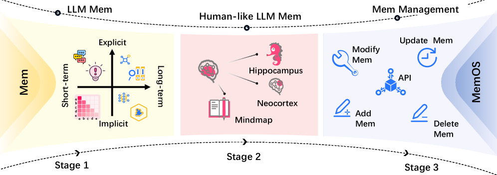

## 2Memory in Large Language Models

Research in memory capabilities in large language models has generally progressed through four key stages:(1) The stage of definition and exploration, which focuses on categorizing and analyzing LLM memory systems from multiple perspectives, while identifying effective optimization mechanisms applicable in real-world scenarios.(2) The stage of human-like memory development, which addresses performance gaps in complex tasks arising from discrepancies between LLM and human memory by introducing various forms of cognitively inspired memory mechanisms.(3) The stage of tool-based memory management, where modular interfaces for memory operations begin to emerge, yet are largely limited to basic insert, delete, and update functionalities over existing memory structures.
Our proposedMemOSintroduces operating system–inspired resource management mechanisms to LLM memory, offering standardized and unified interfaces for full-lifecycle memory management and scheduling. This paves the way toward(4) The stage of systematic memory governance, enabling structured evolution, abstraction, and secure control over memory resources.
In this subsection, we review existing research on memory in large models along this developmental trajectory.

### 2.1Stage 1: Memory Definition and Exploration

Several recent studies have proposed systematic classifications and analyses of memory in LLMs from various dimensions. For example,[19]categorizes memory into three types: parameter memory, unstructured contextual memory, and structured contextual memory.[20]classifies memory based on object (personal vs. system), form (parametric vs. non-parametric), and temporal aspects (short-term vs. long-term).[21]further divides memory into four types: parameter-based, key-value cache-based, hidden state-based, and text-based, and introduces retention duration as a standard to distinguish sensory memory, short-term memory, and long-term memory.

Building on these works, we propose that LLM memory can be characterized along two primary dimensions:implicitandexplicit. Implicit memory includes parameter memory, key-value cache, and hidden states, while explicit memory involves text- and context-based information storage.
Memory can be classified temporally as sensory, short-term, or long-term. Sensory memory captures fleeting impressions of perceptual input, with extremely short duration and no conscious processing. While traditionally treated as a separate stage, we include it under short-term memory for unified scheduling and handling of initial information. This work adopts this two-dimensional framework to analyze memory mechanisms in the first and second stages (see Figure3left, Table1).

<table>
<tr>
<td>

Timescale

</td>
<td>

Consciousness

</td>
<td>

Mechanism

</td>
<td>

Example References

</td>
</tr>
<tr>
<td rowspan="4">

Short-term
 

</td>
<td>

Explicit
 

</td>
<td>

Prompt-Based Context

</td>
<td>

GPT-2 [22], GPT-3 [23], Prefix-Tuning [24], Prompt-Tuning [25], P-Tuning [26, 27], InstructGPT [28]

</td>
</tr>
<tr>
<td rowspan="3">

Implicit
 

</td>
<td>

Key-Value Cache Mechanism

</td>
<td>

vLLM [29], StreamingLLM[30], H2O[31], LESS [32], KVQuant [33], RetrievalAttention [34], Memory3 [1]

</td>
</tr>
<tr>
<td>

Hidden State Steering

</td>
<td>

Steer [35], ICV [36], ActAdd [37], StyleVec [38], CAA [39], FreeCtrl [40], EasyEdit2 [41]

</td>
</tr>
<tr>
<td>

Activation Circuit Modulation

</td>
<td>

SAC [42], DESTEIN [43], LM-Steer [44]

</td>
</tr>
<tr>
<td rowspan="4">

Long-term
 

</td>
<td>

Explicit
 

</td>
<td>

Non-parametric Retrieval-Augmented Generation

</td>
<td>

kNN-LMs [45, 46], MEMWALKER [9], Graph RAG [10], LightRAG [11], NodeRAG [47, 48], HyperGraphRAG [49], HippoRAG [50, 51], PGRAG[52], Zep [53], A-MEM [54], Mem0[55]

</td>
</tr>
<tr>
<td rowspan="3">

Implicit
 

</td>
<td>

Parametric Knowledge

</td>
<td>

BERT [56], RLHF [57], CTRL [58], SLayer [59]

</td>
</tr>
<tr>
<td>

Modular Parameter Adaptation

</td>
<td>

LoRA [60], PRAG [61], DyPRAG [62], SERAC [63], CaliNet [64], DPM [65], GRACE [66]

</td>
</tr>
<tr>
<td>

Parametric Memory Editing

</td>
<td>

ROME [67], MEMIT [68], AlphaEdit [69], AnyEdit [70], EasyEdit [71], AdaPLE [72], MEMAT [73]

</td>
</tr>
</table>

#### 2.1.1Implicit Memory in LLMs

##### Implicit Long-term Memory in LLMs

Through large-scale pretraining, LLMs encode syntactic structures, conceptual relationships, and language usage patterns from corpora into their weight matrices. These parameters serve as implicit long-term memory, internalized into the model’s inherent capabilities. Although they lack explicit expression, they continuously influence language generation behavior, knowledge expression, and even semantic generalization.

Training:In LLMs, training is the most fundamental and direct method for forming implicit long-term memory. For example, pretraining[56,23]and post-training[57,28]enable large-scale parameter updates, fundamentally reconstructing the internal knowledge distribution and behavioral structure of the model.
Some studies introduce memory explicitly during training. For instance, CTRL[58]includes control codes in training data to help models automatically associate contextual information during text generation. Memory&Reasoning[74]fine-tunes the model to decouple output into separate memory and reasoning components, fully leveraging memory for inference. SLayer[59]identifies memory-relevant layers in the model and locally fine-tunes them to enhance specific knowledge representation.
It is worth noting that relying solely on memorization of training data can be limited in real-world deployment due to distributional shifts between real-world and training data.
Titans[75]proposes a dynamic memory mechanism by encoding historical information into neural network parameters and training a pluggable online meta-model. This meta-model can adaptively decide retention or forgetting strategies for specific data during real usage, thereby improving generalization across distribution shifts.

Adaptor:Full-scale training or fine-tuning is costly and often impractical for rapid memory updates in real-world scenarios.
To address this, adapter-based methods freeze the core model parameters and introduce small, trainable modules that adapt quickly to new memory with minimal disruption to original capabilities.
LoRA[60]inserts low-rank adapters into the model, enabling lightweight parameter tuning without modifying the original parameter structure, supporting efficient loading and storage of implicit memory.
PRAG[61]treats LoRA adapter modules trained for specific documents or tasks as “memory units” and merges them into the main model as needed, enabling rapid access to specialized knowledge.
Furthermore, DyPRAG[62]introduces a neural generator that directly maps input documents to LoRA parameters, significantly reducing explicit memory storage cost.

Editing:Memory editing refers to targeted interventions on model parameters to induce new knowledge or behaviors for specific inputs while preserving existing capabilities as much as possible.
Most existing research focuses on editing objective factual knowledge, such as correcting answers to questions like “Who is the president of the United States?”
However, memory in LLMs also includes abstract competencies such as language style, semantic preferences, and reasoning modes, for which systematic editing methods are still lacking.
If not carefully controlled, local parameter edits can lead to undesirable global behavior shifts. Thus, edit precision and retention of existing capabilities are key evaluation metrics.
This paper follows[76]in categorizing knowledge editing techniques into three types:(1) Locate-then-edit intuitive methods[67,68,77]: These methods use causal tracing to locate where the target knowledge is stored, followed by targeted parameter updates.(2) Meta-learning-based methods[78,79,80]: These use hypernetworks to directly predict parameter changes. Another important direction is preserving prior knowledge and abilities during editing[69,70,72].(3) Adapter-based editing strategies[64,63,66,65]: These preserve the LLM backbone, offering a degree of edit controllability.

##### Implicit Short-term Memory in LLMs

Beyond the internalized parametric long-term memory, LLMs also depend on dynamically generated and transient intermediate representations during inference—such as KV-caches and hidden states. Although these representations lack explicit forms, they continually influence attention distributions and behavioral strategies in autoregressive generation, forming the implicit short-term memory of LLMs. They play a vital role in maintaining contextual coherence, enabling instant control, and facilitating behavior transition, and have become a crucial entry point for understanding and enhancing dynamic capabilities of language models.

KV-cache:KV-cache stores key-value representations of previously processed tokens, enabling persistent access to historical memory during autoregressive generation. Although users cannot directly manipulate these caches, they implicitly modulate attention and output behavior during inference[1].
Subsequent optimization work has focused primarily on improving compute and memory efficiency. Techniques such as low-rank compression and quantization are adopted by LESS[32]and KVQuant[33], while StreamingLLM[30]and H2O[31]dynamically prune less relevant KV pairs based on attention patterns.
More recent studies introduce retrieval-based memory activation[81,34], enabling selective access to cached content. Meanwhile, vLLM[29]draws from operating system design by implementing PagedAttention—using virtual memory-style page caching to reduce redundant storage and improve KV access.

While most existing work focuses on optimizing KV-cache for inference efficiency, its capacity to represent structured and controllable knowledge remains underexplored. Memory3[1]takes a first step in this direction by encoding external knowledge bases as sparse key-value pairs, which are injected into the model’s self-attention layers. This enables dynamic, non-parametric retrieval of relevant information during inference, effectively externalizing knowledge and improving memory controllability—offering new directions for the structured use of short-term memory.
Building on the foundation laid by Memory3,MemOSadvances the notion of structured memory by proposing the first hierarchical memory architecture for LLMs that models and unifies three distinct substrates: plaintext memory, activation memory, and parameter memory. It introduces an integrated retrieval and scheduling framework that enables explicit control, efficient fusion, and dynamic activation. The MemCube module further organizes semantic fragments into a multi-dimensional structure, enabling query-based aggregation and multi-granularity activation—paving the way for more systematic and scalable memory utilization in LLMs.

Hidden States:Hidden states represent the layer-wise intermediate activations within LLMs during processing, encoding the model’s semantic understanding and generation trajectory. Compared to modifying model parameters, directly manipulating hidden states offers a more flexible, instantaneous, and efficient means of memory control.
Among the various mechanisms, steering vectors[35]stand out as a representative method. These vectors are derived by computing activation differences between inputs with contrasting semantic attributes, forming directionally meaningful control signals. Injecting such vectors into the intermediate activations of other inputs can steer generation toward specific semantic directions without altering the model architecture.
To avoid reliance on supervised corpora, methods like Self-Detoxifying[82], ActAdd[37], ICV[36], StyleVec[38], and CAA[39]propose unsupervised contrastive approaches. These construct semantically similar yet attribute-opposing input pairs (e.g., emotion, stance, politeness) to extract hidden state differences and generate steering vectors, enabling automated, lightweight signal derivation. This not only enhances the portability of steerable control but also lowers its entry barrier.
As an implicit short-term memory mechanism, hidden states have been validated in various practical tasks. For example, steering vectors have been employed in hallucination mitigation and factual consistency enhancement in ACT[83], ITI[84], and InferAligner[85]. IFS[86]extends their application to controlling low-level generation features such as text formatting and sentence length, indicating that hidden state interventions are effective not only for abstract semantics but also for structural behavior modulation.

#### 2.1.2Explicit Memory in LLMs

##### Explicit Short-term Memory in LLMs

LLMs’ explicit short-term memory primarily resides in their input context window—namely, the prompt and directly concatenated historical dialogues, including user task descriptions, interaction history, and reference documents. These explicitly injected elements are directly perceived and utilized during inference, forming the basis for understanding the current context and generating responses.
With the increasing scale and capabilities of LLMs, their ability to manage explicit short-term memory has significantly improved. From early general-purpose language models relying on static text input[22,23], to parameterized prompt techniques using learnable continuous vectors[24,25,26,27], to advanced instruction-following models[87,88,89], and the InstructGPT-style instruction tuning paradigm[28], mechanisms for expressing and managing explicit short-term memory have evolved from static configuration to dynamic interaction, becoming increasingly structured and flexible.
However, explicit short-term memory in LLMs is physically constrained by context window length. When handling lengthy texts or multi-turn dialogues, models often encounter truncation of early content and memory fading, leading to diminished semantic coherence or loss of key information[90,91]. Recent research has attempted to alleviate these bottlenecks through longer windows, external retrieval, or more efficient caching, yet the capacity of explicit short-term memory remains a key limiting factor in real-time comprehension and interaction.

##### Explicit Long-term Memory in LLMs

Unlike short-term memory dependent on context windows, LLMs’ explicit long-term memory emphasizes sustained access to external non-parametric knowledge, with a focus on optimizing memory organization structures and retrieval strategies.
Early research focused on identifying effective retrieval mechanisms for recalling relevant content from standalone external memory stores. Common approaches include off-the-shelf retrievers such as BM25[92], Dense Passage Retrieval (DPR)[93], and hybrid retrieval methods[94].
However, such retrieve-then-generate approaches impose an inherent bottleneck in integrating retrieved content into model reasoning. Thus, some studies have explored tighter coupling of retrieval with inference. Non-parametric language models (NPLMs) such as kNN-LMs[45,46]propose a linear fusion of neural language models (e.g., Transformers) with k-nearest-neighbor retrieval. At each prediction step, they retrieve top-matching context chunks from memory and blend their influence into the model’s output distribution to improve reference fidelity.

Due to the limited representational capacity of flat memory structures, optimizing retrieval alone often fails to surpass performance ceilings. As a result, research has increasingly shifted toward enhancing memory organization itself. Traditional key-value formats have gradually evolved into more hierarchical and relational structures, such as tree-based[9]and graph-based formats[10,11].
To further represent diverse memory relationships, researchers have introduced heterogeneous graphs[47,48]and hypergraph structures[49], enabling unified modeling and dynamic control of varied knowledge types and complex semantic links. These advances greatly enhance the expressive power and generalization of memory networks. To endow LLMs with structured, dynamic, and persistent memory, Zep[53]builds on GraphRAG[10]by adding timeline modeling to track memory evolution over time. A-MEM[54]draws from dynamic memory networks to support automatic memory linking and semantic updating, allowing LLM memory to evolve across multi-turn interactions.

### 2.2Stage 2: Development of Human-like Memory

To enhance the memory capabilities of LLMs in complex tasks, some studies have drawn inspiration from human memory mechanisms and knowledge management methods, proposing various forms of human-like memory.

In the early stages of human-like memory research, the focus was on simulating the structural and functional mechanisms of human memory.
One representative early work is the HippoRAG series of models[50,51], inspired by the "hippocampal indexing theory" in human long-term memory.
The model integrates LLMs, knowledge graphs, and the Personalized PageRank algorithm to emulate the roles of the neocortex and hippocampus in memory, achieving more efficient knowledge integration and retrieval.
Memory3[1], inspired by the hierarchical structure of human memory, makes the KV-cache in the attention mechanism explicit as a memory carrier for the model.
This approach offers a lower-cost alternative to parameter storage or traditional RAG, significantly reducing the resource consumption for training and inference.

As research advanced, system designs began emphasizing human-like behavior and function, simulating how humans actually use memory.
For instance, PGRAG[52]mimics the act of note-taking during reading, automatically generating mind maps as explicit long-term memory to enhance organization and durability.
Second-Me[95]proposes a multi-level architecture centered on human-like memory behaviors, emphasizing experience-driven personalized retrieval.
The system consists of three layers: L0 retains raw data for completeness; L1 enhances organization and retrievability through structured natural language; L2 internalizes user preferences via parameter tuning, enabling associative reasoning similar to humans.
AutoGen[96]introduces a multi-agent framework to simulate human group collaboration, forming a dialog ecosystem of interacting agents.
Each agent has distinct roles, and they collaborate through dialog to share information and accomplish complex tasks like mathematical reasoning, information retrieval, and code generation.

### 2.3Stage 3: Tool-based Memory Management

With the growing understanding of memory in LLMs, researchers have begun exploring explicit manipulation of knowledge, pushing memory management from implicit representations toward tool-based interfaces.

This stage witnessed the emergence of standardized frameworks for memory editing, enabling users to dynamically update the model’s semantic behavior through insert, modify, and delete operations. For example, early approaches like EasyEdit[71,41]offer unified interfaces to manipulate model parameters and hidden states for fine-grained control.
Another representative line of work is Mem0[97], which targets the context window bottleneck by introducing external memory modules maintained through extract-update workflows. Follow-ups to Mem0 even structure conversational memory into graphs to enable richer semantic modeling and long-term evolution.
Among these, Letta[98]stands out as a system-oriented attempt. It draws inspiration from traditional operating systems by modularizing context and introducing function-style paging for dynamic memory access.

However, most work in this stage remains limited to interface-level utilities. While tool-based management introduces basic CRUD operations, it lacks systematic modeling and governance of memory as a core resource—making it insufficient for tasks requiring memory evolution, coordination, or security.

### 2.4Stage 4: Systematic Memory Governance

Although tool-based management introduces explicit memory operation interfaces, it essentially patches implicit mechanisms.
CRUD capabilities alleviate short-term issues but fall short of addressing systemic challenges like memory evolution, access control, and version management.
Just as system calls alone cannot build a complete OS, "tooling" memory lacks a sustainable and scalable governance architecture.

To overcome the limitations of tool-based management, we proposeMemOS, a memory operating system purpose-built for LLMs, marking the entry into the stage of systematic memory governance.MemOStreats memory units as first-class resources and builds upon operating system design principles to introduce comprehensive governance mechanisms including scheduling, layering, API abstraction, permission control, and exception handling.
Unlike the tool-based phase,MemOSnot only enables operations but also emphasizes the evolution and integration of memory across tasks, sessions, and agent roles.
With core modules such as MemScheduler, Memory Layering, and Memory Governance,MemOSenables unified scheduling and behavior-driven evolution of heterogeneous memory types—building a long-term cognitive structure essential for AGI.
We envision the “memory-as-OS” paradigm pioneered byMemOSas the infrastructural backbone for future general-purpose agents, enabling sustainable knowledge accumulation and self-evolution.