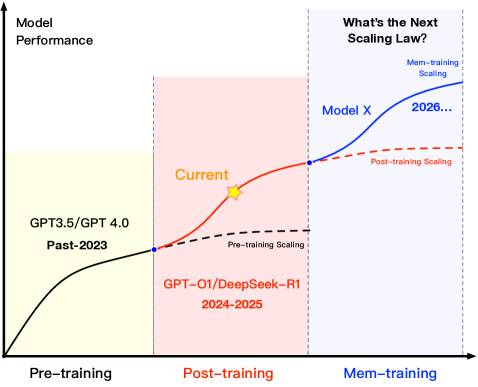

## 3MemOSDesign Philosophy

### 3.1Vision ofMemOS

As AGI advances toward increasingly complex systems involving multiple tasks, roles, and modalities, LLMs must go beyond merely “understanding the world”—they must also “accumulate experience,” “retain memory,” and “continuously evolve.” However, current mainstream LLM architectures lack systematic support for memory as a core intelligence capability: knowledge is rigidly encoded in parameters, context cannot be preserved across sessions, personalization cannot be retained, and knowledge updates are prohibitively expensive. We argue that the next-generation LLM architecture must adopt a memory-centric design paradigm.

As shown in Figure4, model performance is approaching the upper limits predicted by traditional scaling laws. The prevailing research paradigm is transitioning from data- and parameter-centric pretraining to post-training, which emphasizes reinforcement alignment and instruction tuning[99]. Yet this shift faces two major challenges: diminishing returns and growing system complexity. To unlock the next leap in capability, we must transcend the current paradigm by incorporating continuous memory modeling and dynamic memory scheduling—thereby enabling long-term knowledge accumulation, task adaptation, and behavioural evolution.

Beyond the temporal benefits of continual learning, memory training also introduces a spatial scaling effect. Thousands of heterogeneously deployed model instances can gather experience in situ and exchange compact memory units—rather than expensive parameters or gradients—to build a collective knowledge base. This memory-parallel regime blurs the line between training and deployment, effectively extending data parallelism to a society-scale, distributed intelligence ecosystem.
Two technical challenges arise:
(1) efficient knowledge exchange across highly heterogeneous environments, and
(2) strict governance that protects private or sensitive data while maximising shared utility.

We therefore advocate a memory-centric training strategy—the Mem-training Paradigm. Instead of relying solely on sporadic parameter updates, Mem-training drives continuous evolution through explicit, controllable memory units. Unlike traditional workflows that modify the model only during pretraining or fine-tuning, Mem-training allows knowledge to be collected, re-structured, and propagated at runtime, enabling self-adaptation across tasks, time horizons, and deployment environments.

In this paradigm, "training" is no longer limited to large-scale corpora but extends to dynamic knowledge accumulation via continuous interaction with users and the environment. The focus shifts from how much knowledge the model learns once to whether it can transform experience into structured memory and repeatedly retrieve and reconstruct it.MemOSserves as the system-level foundation for this paradigm, enabling end-to-end capabilities in memory generation, scheduling, fusion, and updating.

Our vision is forMemOSto become the foundational memory infrastructure for next-generation intelligent agents, with its core mission expressed through the following three pillars:

- •Memory as a System Resource: Abstract memory from a latent, internal dependency into a first-class, schedulable, and manageable resource. Build memory pathways that span agents, users, applications, and sessions, breaking down "memory silos" across platforms, significantly reducing memory management complexity, and improving the effectiveness and efficiency of memory access.
- •Evolution as a Core Capability: Enable continuous learning, structural reorganization, and task transfer throughout long-term memory usage. Build a co-evolutionary infrastructure for models and memory, allowing LLMs to self-adapt and upgrade in response to changing tasks, environments, and feedback—achieving truly sustainable, evolving intelligence.
- •Governance as the Foundation for Safety: Provide lifecycle-wide memory governance mechanisms including access control, versioning, provenance auditing, and more. Ensure controllability, traceability, and explainability of memory, laying the groundwork for secure, trustworthy, and compliant intelligent agent systems.

Memory as a System Resource: Abstract memory from a latent, internal dependency into a first-class, schedulable, and manageable resource. Build memory pathways that span agents, users, applications, and sessions, breaking down "memory silos" across platforms, significantly reducing memory management complexity, and improving the effectiveness and efficiency of memory access.

Evolution as a Core Capability: Enable continuous learning, structural reorganization, and task transfer throughout long-term memory usage. Build a co-evolutionary infrastructure for models and memory, allowing LLMs to self-adapt and upgrade in response to changing tasks, environments, and feedback—achieving truly sustainable, evolving intelligence.

Governance as the Foundation for Safety: Provide lifecycle-wide memory governance mechanisms including access control, versioning, provenance auditing, and more. Ensure controllability, traceability, and explainability of memory, laying the groundwork for secure, trustworthy, and compliant intelligent agent systems.

We believe that just as traditional operating systems laid the foundation for modern computing by unifying computation and storage management,MemOSwill elevate memory to a core system resource, forming an indispensable foundation for both general-purpose and embodied intelligent agents. This will drive a paradigm shift from reactive, perception-based systems to memory-driven, evolving agents.

### 3.2From Computer OS to Memory OS

In traditional computing systems, the operating system (OS) centrally manages key hardware resources—such as the central processing unit (CPU), memory, storage devices, and peripherals—to support efficient execution and stable operation of applications. The OS’s abstraction of resources, unified scheduling, and lifecycle governance serve as the foundation for the scalability and reliability of modern computing infrastructures.

As large language models (LLMs) scale in inference and application complexity, both internal and external memory resources—ranging from static parameter memory to runtime activation memory and dynamically retrieved explicit memory modules—exhibit increasingly dynamic and heterogeneous behavior. These memory forms are not only foundational to inference but also continuously evolve with task shifts and knowledge updates. Therefore, LLMs similarly require a systematic resource management framework akin to traditional operating systems, enabling standardized abstraction, dynamic scheduling, and autonomous lifecycle governance of memory.

MemOSproposes a design philosophy for the unified and systematic management of memory resources in LLMs, drawing extensively on mature mechanisms from traditional OS domains such as resource scheduling, interface abstraction, access control, and fault handling. Table2illustrates the mapping between classical OS components andMemOSmodules:MemOScoordinates inference and memory block scheduling via the LLM Core and MemScheduler, manages hierarchical memory through Memory Layering and MemStore, offers standardized API abstraction through MemAPI and Backend Adapter, enforces security and access governance through Memory Governance, and supports monitoring and anomaly detection through the Memory Observability framework. These modules work in concert to adapt traditional resource management principles to the evolving demands of memory in LLMs.

<table>
<tr>
<td>Layer</td>
<td>OS Component</td>
<td>MemOS Module</td>
<td>Role</td>
</tr>
<tr>
<td colspan="4">Core Operation Layer</td>
</tr>
<tr>
<td>Parameter Memory</td>
<td>Registers / Microcode</td>
<td>Parameter Memory</td>
<td>Long-term ability</td>
</tr>
<tr>
<td>Activation Memory</td>
<td>Cache</td>
<td>Activation Memory</td>
<td>Fast working state</td>
</tr>
<tr>
<td>Plaintext Memory</td>
<td>I/O Buffer</td>
<td>Plaintext Memory</td>
<td>External episodes</td>
</tr>
<tr>
<td colspan="4">Management Layer</td>
</tr>
<tr>
<td>Scheduling</td>
<td>Scheduler</td>
<td>MemScheduler</td>
<td>Prioritise ops</td>
</tr>
<tr>
<td>Persistent Store</td>
<td>File System</td>
<td>MemVault</td>
<td>Versioned store</td>
</tr>
<tr>
<td>System Interface</td>
<td>System Call</td>
<td>Memory API</td>
<td>Unified access</td>
</tr>
<tr>
<td>Backend Driver</td>
<td>Device Driver</td>
<td>MemLoader / Dumper</td>
<td>Move memories</td>
</tr>
<tr>
<td>Package Deploy</td>
<td>Package Manager</td>
<td>MemStore</td>
<td>Share bundles</td>
</tr>
<tr>
<td colspan="4">Governance &amp; Observability</td>
</tr>
<tr>
<td>Auth / ACLs</td>
<td>Auth Module, ACLs</td>
<td>MemGovernance</td>
<td>Access control</td>
</tr>
<tr>
<td>Logging</td>
<td>Syslog</td>
<td>Audit Log</td>
<td>Audit trail</td>
</tr>
<tr>
<td>Fault Handling</td>
<td>Excp. Handler</td>
<td>Error Recovery</td>
<td>Error recover</td>
</tr>
</table>