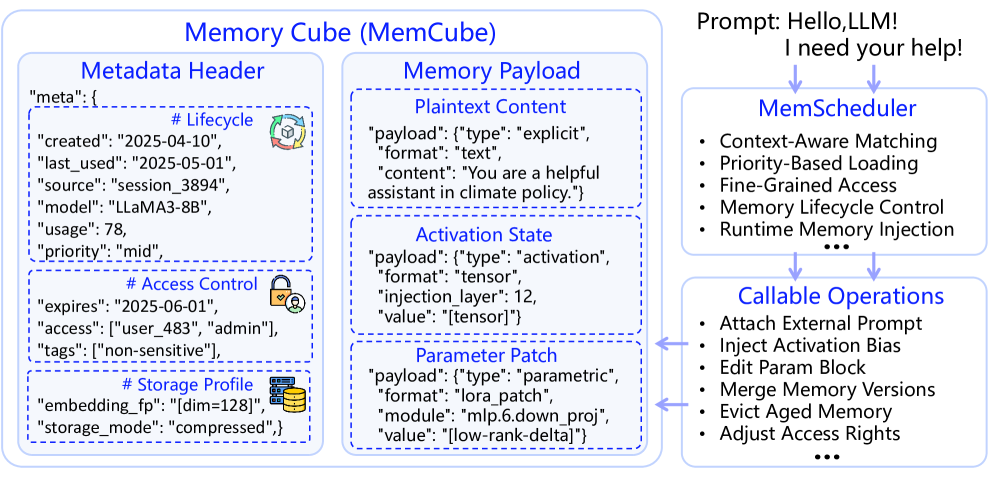

## 4Memory Modeling inMemOS

### 4.1Types of Memory inMemOS

The concept of hierarchical memory was originally introduced in our prior work Memory3[1], which proposed a distinction between explicit and implicit memory paths in LLMs and investigated their interaction mechanisms.

Building on this foundation,MemOSsystematizes the idea by delineating three core memory types—Plaintext Memory,Activation Memory, andParameter Memory—that together reflect a full semantic evolution trajectory from perception to consolidation.

To coordinate scheduling and evolution across heterogeneous memory types,MemOSintroduces theMemCube—a unified abstraction that standardizes memory representation, lifecycle management, cross-modal fusion, and dynamic memory state transitions.
Its design is inspired by the controllable externalization proposed in Memory3, while advancing it into a composable and schedulable memory substrate suitable for intelligent agent construction.
This design forms the semantic memory backbone ofMemOS, enabling seamless integration and transformation of multiple memory types during inference.

##### Plaintext Memory

Plaintext memory refers to explicit, dynamically retrieved knowledge modules accessed via external interfaces—editable, traceable, and storable independently.
Examples include retrieved passages, structured graphs, and prompt templates.
Injected into model input, it bypasses the limitations of parameter capacity and context window size.
It enables rapid knowledge updates, task customization, and user personalization.

MemOSencapsulates plaintext memory into tunableMemCubes, with lifecycle control, access policies, and version tracking.
It supports graph-structured and multimodal memory, contextual fingerprinting, and timestamp-based loading.
Plaintext memory is not merely an external plugin.MemOSdeeply integrates it into the inference loop, enabling interaction with activation memory.
High-frequency plaintext can be transformed into activation paths, achieving dynamic externalization and internalization of knowledge.
To enhance scheduling efficiency and long-term evolvability,MemOSmanages plaintext memory in a hierarchical graph structure organized by task–concept–fact paths.
Task parsing combined with semantic similarity and topic-aware strategies enables structured query routing and prioritized retrieval.
It supports conflict detection, deduplication, versioning, and forgetting policies to maintain memory quality and evolution.

Plaintext memory is particularly suited for fact-heavy, personalized, and multi-agent tasks—serving as a core enabler of transparent and collaborative intelligence.

##### Activation Memory

Activation memory consists of intermediate states generated during inference, with the KV-cache as the central structure.
It retains key-value representations of context, enabling efficient long-range dependency modeling and recursive reasoning.
It supports instant contextual response and reusable inference pathways through cache-stable behaviors.
Other elements include hidden states (hilh^{l}_{i}) and attention weights (αi​jl\alpha^{l}_{ij}), comprising the model’s runtime semantic perception.
These are characterized as short-term, dynamic, and implicitly activated.

MemOSoffers unified scheduling and lifecycle management for activation memory.
It enables lazy loading, selective freezing, and priority-driven adjustments.
Frequent KV patterns are cached to form low-latency “instant memory paths”.
Beyond KV patterns, strategic behaviors that are repeatedly triggered can also be abstracted into persistent memory structures, such as steering vectors or semantic templates.
KV memory proves valuable in multi-turn dialogue, code assistance, and runtime safety management.
For instance, in medical agent systems, stable and frequently accessed knowledge—such as patient histories, routine diagnostic procedures, or clinical commonsense—can be abstracted into cached KV segments, enabling rapid recall and minimizing redundant decoding.
It is essential for maintaining contextual continuity, stylistic coherence, and precise response control.

##### Parameter Memory

Parameter memory refers to knowledge and capabilities encoded in the model’s fixed weights. It serves as the primary repository of long-term semantic knowledge within the model.
It encodes deep representations of linguistic structure, commonsense knowledge, and general semantics—typically instantiated as feedforward weight matrices (e.g.,WMLPlW^{l}_{\text{MLP}}) and attention key/value matrices (e.g.,WKlW^{l}_{K},WVlW^{l}_{V}).
Unlike other memory types, parameter memory is activated implicitly without retrieval or explicit context, forming the foundation for zero-shot inference, general QA, and language generation.

InMemOS, parameter memory includes both pre-trained linguistic and world knowledge and can be modularly enhanced via lightweight fine-tuning methods such as LoRA or adapters.MemOSenables distilling domain-specific knowledge into parameter blocks, loadable as “capability modules" (e.g., summarization expert, legal assistant, style generator).
While offering strong expressivity and high efficiency, parameter memory suffers from high update costs, limited customizability, and poor interpretability.
To address this,MemOSlinks parameter memory with plaintext and activation memories.
For instance, frequently used and structurally stable plaintext may be distilled into parametric form for embedded efficiency.
Conversely, outdated or inconsistent parameter memory can be backpatched by reverting to plaintext.
Parameter memory is ideal for capability-centric agents, such as legal advisors, financial auditors, technical writers, or summarizers, or as composable “capability plugins”.
Compared with frequently updated plaintext or transient activation memory, it better supports long-term, structurally stable capabilities.

### 4.2Memory Cube (MemCube) as a Core Resource

InMemOS, the foundation of a unified and structured memory management system lies in the standardized abstraction and system-level governance of heterogeneous memory resources. To this end, we propose theMemory Cube (MemCube)as a universal encapsulation unit for memory resources (see Figure6).

Memory in LLMs is highly diverse, spanning long-term knowledge embedded in model parameters, intermediate activation states generated during inference, and externally injected structured knowledge fragments (e.g., retrieved passages, knowledge graph nodes). These resources differ significantly in origin, lifecycle, representation, and scheduling method, making unified control, evolution, and governance a systemic challenge.

The design ofMemCubeaims to encapsulate all memory types as unified scheduling units, each with standard interfaces, behavioral properties, and governance strategies. EachMemCubeinstance consists of two components: theMemory Payload, which contains the semantic content, and theMetadata, which encodes identity, control, and behavioral metrics. These metadata elements serve as foundational interfaces forMemOSscheduling and governance and as central anchors for long-term system evolution, task adaptation, and security control.

The metadata of eachMemCubeis categorized into three groups:descriptive identifiers,governance attributes, andbehavioral usage indicators. Together, these enable full-spectrum memory management across structural identification, access control, and behavioral evolution. We elaborate below on their motivations, components, and system-level implications.

##### Descriptive Identifiers

define each memory block’s identity, classification, and organization. Unified memory scheduling at scale relies on precise identification of these “semantic fingerprints.”MemCubeembeds key fields such as:Timestamp, indicating creation or last update for lifecycle modeling;Origin Signature, identifying whether the memory comes from inference extraction, user input, external retrieval, or parameter finetuning; andSemantic Type, specifying its use (e.g., task prompt, fact, user preference) to support semantic composition. These jointly enable layered memory structuring and contextual navigation.

##### Governance Attributes

provide systemic controls for memory access, security, and scheduling. In dynamic, multi-user, long-running systems, default model reasoning is insufficient for robust memory governance.MemOSdefines a comprehensive rule set per memory unit, including:Access Control(read/write/share scope),Lifespan Policy(TTL or decay rules),Priority Level(for scheduling), andCompliance & Traceability(e.g., sensitivity tags, watermarks, logs). Together, they form the memory governance kernel—critical for system stability, transparency, and accountability.

##### Behavioral Usage Indicators

reflect real-time memory usage during inference, enabling “value-driven” scheduling and cross-type transformation. Unlike static labels, these runtime metrics empower adaptive orchestration of memory.

Access Patterns, such as frequency and recency, inform whether a memory is “hot” or “cold” during inference.MemOSuses this to adjust caching priority—for example, promoting high-frequency plaintext memory into fast-access layers to reduce latency.

These indicators also supportCross-Modality Memory Transformation, allowing dynamic transitions across memory types:

- •Plaintext⇒\RightarrowActivation:Frequently used plaintext memory can be pre-transformed into activation vectors or attention templates for faster decoding.
- •Plaintext/Activation⇒\RightarrowParameter:Stable knowledge across tasks can be distilled into parameter modules, internalized as efficient capability plugins.
- •Parameter⇒\RightarrowPlaintext:Cold or outdated parameters can be offloaded into external plaintext storage to increase flexibility and reduce structural overhead.

Plaintext⇒\RightarrowActivation:Frequently used plaintext memory can be pre-transformed into activation vectors or attention templates for faster decoding.

Plaintext/Activation⇒\RightarrowParameter:Stable knowledge across tasks can be distilled into parameter modules, internalized as efficient capability plugins.

Parameter⇒\RightarrowPlaintext:Cold or outdated parameters can be offloaded into external plaintext storage to increase flexibility and reduce structural overhead.

To support such transformations,MemOSintroducesPolicy-Aware Scheduling: the system dynamically adjusts a memory block’s tier and format based on usage frequency, contextual dependency, and task fit—enabling layered memory evolution.
Additionally, each memory is associated with aContextual Fingerprint, a lightweight semantic signature for fast retrieval and task alignment.
AVersion Chainlogs each memory’s modification history and derivation lineage, enabling version control, conflict resolution, and rollback.
These behavioral metrics allowMemOSto perceive the “value” of memory, forming the basis for adaptive scheduling, memory transformation, and knowledge evolution. As a result, memory becomes a self-regulating and self-evolving intelligent resource unit.
Through the coordinated design of these three metadata types,MemCubeenables structured abstraction, permissioned control, and behavior-driven evolution of heterogeneous memory resources.