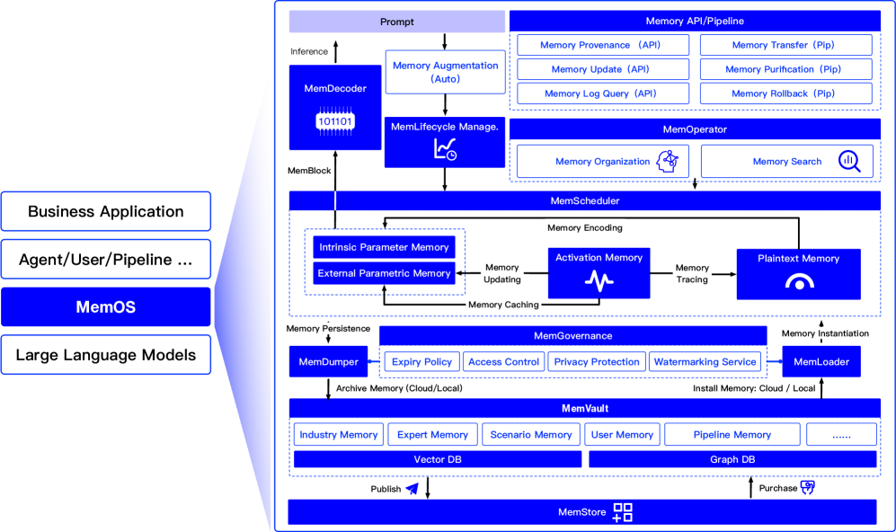
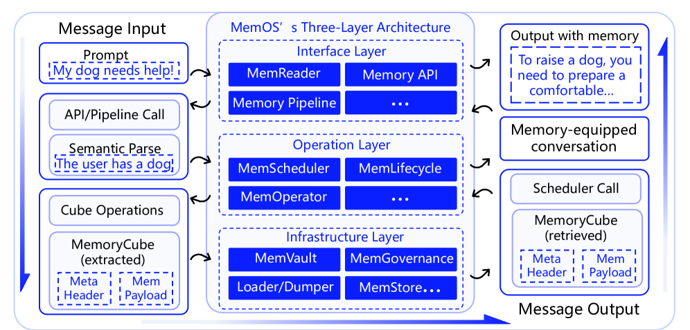

## 5Architecture ofMemOS

### 5.1Overview: Three-layer Architecture ofMemOS

MemOSadopts a modular three-layer architecture to support efficient invocation, dynamic scheduling, and compliant governance of complex memory tasks (see Figure7). It consists of the Interface Layer, Operation Layer, and Infrastructure Layer, each with distinct responsibilities and collaborative interfaces—together building a unified execution and governance framework for heterogeneous memory types that enables robust intelligent agent performance across complex tasks.

##### Memory Interface Layer

The interface layer interacts with users or upstream systems and serves as the entry point for all memory operations.
It provides a standardizedMemory APIsuite that supports querying, writing, updating, transferring, and composing memory units.
All user requests are parsed by the interface layer into specific memory manipulation commands.
The built-inMemReadermodule plays a central role in this process.
It converts natural language inputs into structured memory operation chains, extracting time expressions, task intents, contextual anchors, and memory scopes.
For instance, given a request like “Summarize my meeting notes from last month,”MemReaderextracts the time range (last month), memory type (meeting notes), and output target (summary), and formulates a labeledMemoryQuerywith proper window parameters.
In multi-turn conversations,MemReaderuses context to infer omitted details, ensuring consistency in memory invocation.
This layer also performs permission checks, parameter encapsulation, and call sequence management. It coordinates withMemGovernanceto validate the compliance and traceability of every operation.

##### Memory Operation Layer

The operation layer serves as the control center ofMemOS, organizing, planning, and scheduling memory resources during inference.
Its core components includeMemOperator, which builds tag systems, semantic indexes, and graph-based topologies across heterogeneous memory types and contexts, facilitating efficient retrieval and contextual adaptation.MemSchedulerselects appropriate memory types (e.g., Plaintext, activation, parameter ) based on task intent and context, and dynamically plans invocation order and integration strategy to optimize for low latency and task relevance.MemLifecycletracks the lifecycle transitions of each memory unit—creation, activation, expiration, and reclamation—to ensure memory resource controllability and freshness.
In a multi-turn QA or complex dialogue, the operation layer first retrieves relevant memory (e.g., user preferences, past conversations, external structured documents) viaMemOperator, determines the optimal invocation path viaMemScheduler, and updates memory states usingMemLifecycle.
Thanks to this design, memory becomes a dynamic, context-aware resource rather than a static data fragment.

##### Memory Infrastructure Layer

The infrastructure layer handles storage, security, migration, and flow of memory data, serving as the foundation for reliable system execution.MemGovernanceenforces access control, retention policies, audit logging, and sensitive content handling.MemVaultmanages multiple memory repositories (e.g., user-specific, domain knowledge, shared pipelines) and provides standardized access interfaces.MemLoaderandMemDumperenable memory import/export and cross-platform synchronization.MemStoreprovides a publish-subscribe mechanism for open memory sharing among multiple agents.
In organizational QA systems, for instance, a locally updated memory entry can be validated and synchronized to a central memory hub, becoming available to authorized users.

Together, these three layers form the complete memory operation loop inMemOS—from task input to execution scheduling to governance and archival. The standard interface decoupling allows rapid iteration and extensibility, laying the foundation for multi-model, multi-task, and cross-platform memory sharing in future intelligent systems.

### 5.2Execution Path and Interaction Flow ofMemOS

The execution ofMemOSis triggered by either user interaction or automated tasks. It follows a closed-loop process through input parsing, memory scheduling, state management, and storage archiving(Figure8).

##### Prompt Input and Memory API Packaging

System execution begins with a user-issued natural language prompt or an automatically triggered task. The interface layer processes the input through the built-inMemReadermodule, which identifies task intent, time scope, topic entities, and contextual anchors to determine if memory access is involved. If so,MemReaderconverts the prompt into a structuredMemoryCall, including the caller ID, context scope, memory type, access intent, and time window. This is encapsulated into a standardizedMemory APIrequest and passed to the operation layer for execution.
For example, in a healthcare scenario, when a patient inputs, “Please retrieve my inpatient records from last year,”MemReaderidentifies the time range (last year), topic tag (diagnostic records), contextual anchor (hospitalization period), and intent (historical query), and generates a structuredMemoryCall, which proceeds to the memory retrieval and scheduling pipeline.

##### Memory Retrieval and Organization

TheMemOperatorin the operation layer uses intent and context info from theMemory APIto perform semantic matching and organize memory units. It constructs task-specific indexes (user preferences, anchors, keyword vectors) and memory graphs (temporal chains, entity relations, dependencies) to filter relevant candidates.
For instance, if a patient asks the system to reference past cases for diagnosis, the operator retrieves memory blocks with symptom keywords, treatment periods, and associated physician notes to construct a structured retrieval path.

##### Memory Scheduling and Activation

After the candidate set is identified,MemScheduleroptimizes memory selection using metrics like contextual similarity, access frequency, temporal decay, and priority tags. It dynamically computes the optimal injection strategy.
In a follow-up appointment, the system injects recent consultation summaries (activation memory), diagnosis templates (parameter memory), and lifestyle advice (plaintext memory), ensuring integrated, semantically coherent support.

##### Lifecycle Modeling and State Transitions

Scheduled memory units are passed toMemLifecyclefor state management. Each memory item transitions through five states—Generated, Activated, Merged, Archived, and Expired—based on access patterns, time decay, and task labels.
For example, in medical use, generated medication advice starts in "Generated" state. If frequently accessed, it becomes "Activated"; after repeated user confirmations, it is "Merged" into frequent-use suggestions; and eventually archived or expired if unused.

##### Storage Archiving and Access Governance

Evolved memories are archived inMemVaultand organized by user, task, or context. Archiving may be triggered by policy, user command, or scheduling, keeping frequently accessed data active and less-used data cold or long-term stored.
The archiving phase also invokesMemGovernancefor permission encapsulation and compliance checks. Each memory unit is assigned a set of access control strategies—such as Access Control List (ACL), Time-To-Live (TTL), and conditional activation policies—that determine its availability based on user roles and task context.
For example, a treatment summary may be fully visible to the care team but partially visible to the patient. After redaction and watermarking, it can be registered inMemStorefor sharing across institutions.

The full governance and archiving pipeline ensures that all memory units—across diverse modalities and agents—are handled in a structured, transparent, and traceable manner, maintaining compliance and efficiency across collaborative healthcare environments.

### 5.3Interface Layer

#### 5.3.1MemReader

InMemOS, the first step of any memory operation is interpreting natural language inputs from users or system tasks. This responsibility is handled by theMemReader, which serves as the semantic abstraction module for memory-level reasoning. It parses incoming prompts to extract key memory-related features—such as task intent, temporal scope, entity focus, memory type, and contextual anchors—and outputs a structured intermediate representation.
For example, a prompt like "Remind me what the doctor said about my medication during last year’s hospitalization" would be parsed byMemReaderinto a structured memory access plan: task intent (retrieval), time scope (last year), topic (medication guidance), and context anchor (hospitalization period). This plan is passed downstream as aMemoryCallto be processed by the memory operation layer.MemReaderalso supports prompt rewriting, coreference resolution, and dialogue memory slot filling across multi-turn interactions. It functions as both an intent recognizer and memory orchestrator, ensuring the system issues precise and traceable calls to the underlying memory infrastructure.

#### 5.3.2Memory API

The interface layer ofMemOSis built around a unified and composableMemory API, which bridges upper-level tasks with backend memory operations. All memory-related actions—including creation, updates, retrieval, and auditing—are performed via standardized APIs that ensure extensibility, composability, and governance.Provenance APIenables provenance tracking by embedding metadata into memory objects at creation or modification time. This includes event triggers, contextual state, model identifiers, and external links. Each memory is tagged with a unique provenance ID that persists throughout its lifecycle. Provenance metadata supports explainability, debugging, access control, and memory lineage tracing.Update APIsupports mutation operations such as append, merge, or overwrite. It is version-aware, allowing snapshots and label-based differential writes. Typical use cases include task result logging, user correction, and fine-grained memory consolidation. When paired withMemLifecycle, update operations can trigger state transitions and index refreshes.LogQuery APIallows structured access to memory access logs and execution traces. It supports filtering by timestamp, caller identity, memory type, and operation kind. It is essential for debugging, hotspot analysis, auditing, and governance enforcement. For instance, developers can investigate memory usage that led to faulty responses, or validate whether specific memories were invoked.
AllMemory APIcalls useMemoryCubeas their parameter carrier and response format. They support transactional safety, structured status reporting, and are governed byMemGovernance, which enforces access control based on users, roles, models, and tasks.

#### 5.3.3Memory Pipeline

To support complex workflows in enterprise and multi-agent settings,MemOSoffers a pipeline-style composition mechanism for chaining memory operations. Developers or agent systems can define a sequence of memory actions—e.g., retrieve → augment → update → archive—and execute them as a cohesive pipeline.
Each pipeline step operates on a sharedMemoryCubeobject, which carries input-output state, metadata, and intermediate artifacts. For example, a medical assistant might define a pipeline that (1) retrieves past medication notes viaLogQuery, (2) adds doctor’s latest instructions viaUpdate, (3) tags the memory with a new provenance entry, and (4) archives it post-consultation.
Pipelines support transactional consistency, rollback, and fault isolation. They can be defined declaratively through a domain-specific language (DSL), or constructed programmatically. For agent orchestration,MemSchedulerinterprets dependencies across steps and coordinates scheduling. Pipeline templates can be reused across agents—e.g., for follow-up generation in customer support, or for diagnosis tracking in clinical triage.

By enabling compositional memory flows,MemOSempowers developers to model higher-level cognition patterns, task-specific knowledge shaping, and auditable memory workflows.

### 5.4Operation Layer

#### 5.4.1MemOperator

InMemOS, efficient memory organization and accurate retrieval are fundamental to enabling intelligent behavior generation, contextual reasoning, and knowledge reuse. TheMemOperatormodule fulfills this role by structuring memory content both logically and semantically. It incorporates tag-based annotation, graph-based linking, and hierarchical abstraction to support multi-perspective memory modeling. Simultaneously, it provides unified interfaces for hybrid retrieval, serving diverse agents across tasks, models, and user contexts.

##### Multi-perspective Memory Structuring

MemOSemploys three complementary mechanisms for organizing memory. First, a flexible tagging system allows each memory unit to be annotated with metadata such as topic, source, credibility, and sentiment, supporting both user-defined and model-predicted labels. Second, a knowledge-graph structure treats memory as nodes connected via semantic edges, enabling traversable relations across memory items. Third, a semantic layering scheme segments memory into private, shared, and global layers, facilitating memory isolation and coordinated access across tasks and roles.

##### Hybrid Retrieval and Dynamic Dispatch

TheMemOperatormodule supports hybrid retrieval mechanisms that combine symbolic and semantic strategies. Structured retrieval applies rule-based filtering over tags, time spans, Boolean conditions, and access control policies. Semantic retrieval uses embedding-based vector representations to identify contextually relevant memory units via similarity search. These two mechanisms can be composed into complex query expressions—such as tag filters combined with semantic ranking—to serve applications like multi-turn dialogue, question answering, or knowledge integration.

##### Pipeline Coupling and Caching Strategy

Retrieved memory units are passed downstream as inputs to execution pipelines, tightly coupled with theMemory APIandMemoryCubemodules. To minimize latency,MemOSimplements a local index caching strategy whereby frequently accessed memory is automatically migrated to high-speed intermediate storage. Cache invalidation is managed by heuristics based on usage frequency and contextual drift, with theMemSchedulermodule overseeing refresh operations in a dynamic, workload-aware manner.

##### Task-Aligned Memory Routing

To address the complexity of real-world tasks,MemOSemploys a task-aligned routing mechanism that resolves memory navigation paths based on hierarchical semantic goals. User inputs are decomposed into a topic–concept–fact structure, forming a three-layered task schema. TheMemoryPathResolvercomponent then formulates a retrieval strategy that answers three key questions: what to search, where to search, and in what order. This structured approach enhances interpretability, scheduling relevance, and alignment between memory selection and task intent.

#### 5.4.2MemScheduler

MemScheduleris the central memory dispatcher of theMemOSoperation layer. Its purpose goes beyond simply "retrieving" stored memories; it dynamically transforms and loads them into the runtime context based on task semantics, call frequency, and content stability.
Relying on the three memory types defined inMemCube—Activation Memory (KV-Cache), Plaintext Memory, and Parameter Memory—MemSchedulersupports classification, transformation, and hierarchical dispatch to deliver adaptive, high-performance memory operations.

##### Type-Aware Transformation and Loading Mechanism

During memory scheduling,MemScheduleranalyzes task semantics, window size, and resource constraints to determine the best-fit memory type.
Stable, frequently accessed content is transformed intoActivation Memoryfor KV caching, minimizing prefill latency.
Abstract rules and reusable patterns are encoded asParameter Memory—e.g., via distillation or adapters embedded into model weights.
Time-sensitive or session-specific knowledge is preserved asPlaintext Memory, inserted into the prompt as raw text.
Adaptive triggers guide the loading process.
For coherence-heavy tasks like multi-turn dialogue, the scheduler favors KV-cache recall.
For procedural or expert-driven flows, parametric modules take precedence.
For on-demand factual queries, plain memory is retrieved and contextualized.
All decisions are logged toMemCubeand coordinated withMemOperator’s memory structure to maintain traceability and interpretability.

##### Cross-Type Conversion and Migration

To maintain long-term performance and adaptive memory utilization,MemSchedulersupports cross-type memory migration.
For example, plain memories frequently recalled across sessions may be promoted to Activation Memory (KV cache).
Stable templates used repeatedly can be distilled into parameter Memory.
Conversely, underutilized KV entries may be downgraded to Plain Memory and archived to cold storage.
This type-shifting mechanism ensures memory units evolve toward their optimal invocation form while conserving system resources.

##### Execution Path Integration and Governance

MemSchedulerintegrates upstream withMemReaderand theMemory APIto parse structured calls and semantic goals.
Downstream, it collaborates with model execution paths to determine how and where to inject memory.
Scheduling logic is optimized in real time, guided by task type, model load, cache hit rates, and access history.
All dispatch actions are governed byMemGovernance, which enforces user-role boundaries, rate limits, and lifecycle policies.
This ensures proper memory isolation and secure usage across users, models, and tasks, while maintaining an auditable record of every memory interaction.

#### 5.4.3MemLifecycle

InMemOS, each memory object is treated as a dynamic entity with evolving states, managed centrally by theMemLifecyclemodule.
The system models memory as a finite state machine, cycling through four key states: Generated, Activated, Merged, and Archived.
This framework supports semantic evolution, dynamic memory management, and stable, controlled resource scheduling at the storage layer.

##### State Modeling and Evolution Logic

State transitions are triggered by a combination of system policies and user actions.
For instance, in a smart meeting assistant, an auto-generated summary is initially labeled as “Generated”.
If that summary is later referenced in a follow-up task—like agenda tracking or meeting comparison—it transitions into the “Activated” state.
When the user adds supplementary data, or the system detects semantic overlap with historical memory, these entries are consolidated into a new version and marked as “Merged”.
If a memory is no longer accessed for a prolonged period, it is demoted to the “Archived” state and moved to cold storage.
Transitions can be explicitly initiated by user actions, or implicitly driven by system heuristics such as recency, contextual salience, or successful merge events.

##### Time Machine and Freezing Mechanism

To ensure long-term consistency and recovery,MemOSoffers a “Time Machine” capability that snapshots memory states and supports historical rollbacks.
Users or developers can invoke this feature to restore an archived or merged memory back to a specific version, re-enabling its use in inference and context injection.
This is critical for scenarios such as detecting model forgetting, handling user retractions, or conducting counterfactual simulations.
In a policy collaboration platform, a user might unarchive an old clause to perform “what-if” simulations, without impacting the canonical frozen version and its audit trail.MemOSalso supports a “Frozen” state for critical memories—like legal agreements or standard guidelines—where updates are disabled and full modification histories are retained for auditing, compliance, or education.

##### Scheduling and Storage Integration Strategy

Lifecycle states directly influence scheduling priority and storage allocation strategies.
“Activated” memories are preferentially cached in local memory or fast-accessMemoryCubeinstances for low-latency retrieval.
“Archived” or “Frozen” memories are offloaded toMemVault, a cold storage layer optimized for durability over speed.
Based on lifecycle rules, the system can batch-trigger operations like cleanup, compression, or migration to balance call availability with efficient resource usage.

### 5.5Infrastructure Layer

#### 5.5.1MemGovernance

MemGovernanceis the core module inMemOSresponsible for memory access control, compliance enforcement, and auditability.
As memory systems evolve toward multi-user collaboration and long-horizon task reasoning,MemGovernanceensures that memory remains secure, interpretable, and controllable throughout its sharing, transfer, and inference processes.

It establishes a ternary permission model involving the user identity, the memory object, and the calling context, supporting private, shared, and read-only access policies.
Each memory request undergoes identity authentication and contextual validation to prevent unauthorized access.
For example, in clinical settings, only physicians may access a patient’s diagnostic records; in enterprise systems, only authorized managers can retrieve archived policy documents.

It manages memory lifecycle policies such as time-to-live (TTL) enforcement and access-frequency-based garbage collection or archiving of inactive items.
It also tracks memory usage heat to monitor high-traffic memory segments.
Its privacy control subsystem includes sensitive content detection, automatic redaction, and access logging to ensure personal and behavioral data remain secure.

All memory objects carry full provenance metadata, including creation source, invocation lineage, and mutation logs.
Generated content can be watermarked semantically and tagged with behavioral fingerprints, allowing attribution and copyright tracking in multi-platform scenarios.

The module also exposes audit interfaces for integration with enterprise compliance systems, supporting export of access logs and permission revision reports.
These features support regulatory compliance in high-stakes environments such as healthcare and finance.

#### 5.5.2MemVault

MemVaultis the central memory storage and routing infrastructure inMemOS, responsible for managing and serving diverse categories of memory.
Memory is organized into namespaces such as user-private stores, expert knowledge bases, industry-shared repositories, contextual memory pools, and pipeline-aligned caches.
Each is assigned a dedicated namespace and path structure to support efficient lookup and access control.

To support heterogeneous backends,MemVaultinterfaces with vector stores, relational databases, and blob storage through a unifiedMemoryAdapterabstraction.
This allows API-level consistency for querying, writing, and syncing memory regardless of backend heterogeneity.
Stores may be configured as read-only caches or write-enabled repositories, depending on latency or learning objectives.

At runtime,MemVaultworks in concert withMemSchedulerandMemLifecycleto dynamically load memory based on access history, contextual relevance, and memory state.
It supports tag-based, semantic, and full-text loading patterns, and triggers migration for hot memory to fast storage or cold data to archival zones.
This architecture is vital for multi-model collaboration, domain-level knowledge fusion, and consistency in multi-turn dialogue—forming the knowledge backbone for scalable intelligent systems.

#### 5.5.3MemLoader & MemDumper

MemLoaderandMemDumperform a bi-directional channel for memory migration across platforms inMemOS.
They support injection, export, and synchronization of structured units likeMemoryCube.
This capability is essential for system handover, edge-cloud integration, and knowledge continuity across distributed agents.

During ingestion,MemLoaderaccepts memory from local caches, third-party systems, or archives and maps it to target stores.
It auto-fills provenance metadata, tagging, and lifecycle status to ensure governance readiness.

MemDumperexports selected memory in portable formats with permission metadata, redacted fields, and access logs.
Both components support periodic and event-driven updates, such as automatic export upon tag activation.
The migration process is governed byMemGovernanceto validate policies, trace operations, and isolate sensitive data.
For instance, a mobile device may export patient interaction logs to the cloud, which remote agents later load to preserve task context.

#### 5.5.4MemStore

MemStoreis the open-access interface inMemOSthat enables controlled publishing, subscription, and distribution of memory units.
It supports memory exchange between models, institutions, and even industry-wide networks.

Users may declare memory as publishable and define visibility, usage conditions, and access control rules.
Each shared unit carries unique IDs and provenance metadata;MemGovernanceensures masking, watermarking, and policy validation during dissemination.

MemStoreenables both push and pull models of memory exchange.
Consumers can define subscriptions using tags or semantic filters, and the system delivers matched updates proactively.
Licensed memory assets can enforce contract-bound access frequencies and expiry policies.
All access is logged with invocation traces to support audit and accountability.

For example, a hospital may publish de-identified diagnostic records for remote triage agents, with every call validated for context and provenance.