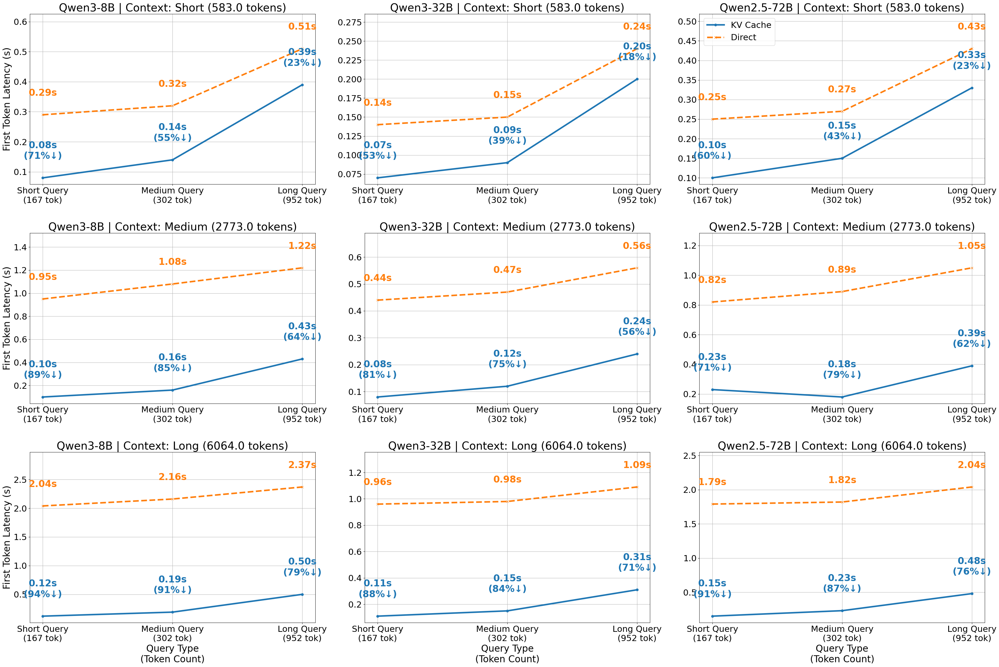

## 6Evaluation

To systematically evaluate the capabilities ofMemOS, we conduct both holistic and component-level experiments.
We begin by benchmarking the full system on the LOCOMO benchmark suite to assess its performance in memory-intensive reasoning tasks, comparing against several state-of-the-art baselines.
In addition, we present targeted evaluations of key architectural subsystems, including multi-perspective memory organization, hybrid semantic retrieval, task-aligned scheduling, and KV-based activation memory injection. These experiments assess the individual effectiveness of each component and its contribution to overall system performance.

### 6.1End-to-End Evaluation on LOCOMO

<table>
<tr>
<td>Category</td>
<td>Method</td>
<td>
<table>
<tr>
<td>Chunk /</td>
</tr>
<tr>
<td>Mem Tok</td>
</tr>
</table>
</td>
<td>Top-K</td>
<td>LLMJudge Score</td>
<td>F1</td>
<td>RL</td>
<td>B1</td>
<td>B2</td>
<td>METEOR</td>
<td>BERT-F1</td>
<td>Sim</td>
</tr>
<tr>
<td></td>
<td>langmem</td>
<td>165</td>
<td>-</td>
<td>68.21±0.06</td>
<td>41.72</td>
<td>44.80</td>
<td>35.61</td>
<td>24.73</td>
<td>36.42</td>
<td>43.77</td>
<td>
\ul76.25
</td>
</tr>
<tr>
<td></td>
<td>zep</td>
<td>2320</td>
<td>20</td>
<td>50.42±0.29</td>
<td>32.49</td>
<td>35.07</td>
<td>27.38</td>
<td>18.81</td>
<td>28.49</td>
<td>35.26</td>
<td>66.95</td>
</tr>
<tr>
<td></td>
<td>openai</td>
<td>4141</td>
<td>-</td>
<td>61.83±0.10</td>
<td>36.96</td>
<td>41.45</td>
<td>30.72</td>
<td>22.02</td>
<td>35.39</td>
<td>40.56</td>
<td>69.84</td>
</tr>
<tr>
<td></td>
<td>mem0</td>
<td>1176</td>
<td>20</td>
<td>
\ul73.33±0.20
</td>
<td>47.26</td>
<td>51.44</td>
<td>40.34</td>
<td>30.02</td>
<td>
\ul43.96
</td>
<td>48.53</td>
<td>76.56</td>
</tr>
<tr>
<td>

single

hop
</td>
<td>memos-0630</td>
<td>1600</td>
<td>20</td>
<td>78.44±0.11</td>
<td>
\ul45.55
</td>
<td>
\ul51.00
</td>
<td>
\ul38.32
</td>
<td>
\ul28.32
</td>
<td>44.46</td>
<td>
\ul47.53
</td>
<td>74.70</td>
</tr>
<tr>
<td></td>
<td>langmem</td>
<td>185</td>
<td>-</td>
<td>56.74±0.29</td>
<td>36.03</td>
<td>36.32</td>
<td>27.22</td>
<td>17.03</td>
<td>
\ul29.14
</td>
<td>
\ul33.03
</td>
<td>73.05</td>
</tr>
<tr>
<td></td>
<td>zep</td>
<td>2351</td>
<td>20</td>
<td>42.20±0.77</td>
<td>23.14</td>
<td>24.63</td>
<td>14.96</td>
<td>8.49</td>
<td>17.38</td>
<td>25.15</td>
<td>64.26</td>
</tr>
<tr>
<td></td>
<td>openai</td>
<td>3924</td>
<td>-</td>
<td>
\ul60.28±0.00
</td>
<td>33.10</td>
<td>35.36</td>
<td>23.84</td>
<td>15.36</td>
<td>27.25</td>
<td>32.36</td>
<td>68.82</td>
</tr>
<tr>
<td></td>
<td>mem0</td>
<td>1163</td>
<td>20</td>
<td>58.75±0.44</td>
<td>35.24</td>
<td>34.87</td>
<td>25.91</td>
<td>16.55</td>
<td>27.90</td>
<td>32.65</td>
<td>
\ul70.71
</td>
</tr>
<tr>
<td>

multi

hop
</td>
<td>memos-0630</td>
<td>1528</td>
<td>20</td>
<td>64.30±0.44</td>
<td>
\ul35.57
</td>
<td>
\ul36.25
</td>
<td>
\ul26.71
</td>
<td>
\ul16.59
</td>
<td>29.42</td>
<td>33.85</td>
<td>69.60</td>
</tr>
<tr>
<td></td>
<td>langmem</td>
<td>209</td>
<td>-</td>
<td>
\ul49.65±1.30
</td>
<td>29.79</td>
<td>
\ul30.54
</td>
<td>23.17</td>
<td>
\ul11.72
</td>
<td>
\ul21.03
</td>
<td>32.27</td>
<td>67.34</td>
</tr>
<tr>
<td></td>
<td>zep</td>
<td>2276</td>
<td>20</td>
<td>38.19±0.49</td>
<td>19.76</td>
<td>20.62</td>
<td>13.17</td>
<td>6.18</td>
<td>14.20</td>
<td>21.07</td>
<td>58.59</td>
</tr>
<tr>
<td></td>
<td>openai</td>
<td>4071</td>
<td>-</td>
<td>32.99±1.30</td>
<td>17.19</td>
<td>15.88</td>
<td>11.04</td>
<td>5.23</td>
<td>12.05</td>
<td>19.37</td>
<td>57.53</td>
</tr>
<tr>
<td></td>
<td>mem0</td>
<td>1141</td>
<td>20</td>
<td>45.83±0.00</td>
<td>27.80</td>
<td>28.67</td>
<td>20.01</td>
<td>10.59</td>
<td>20.33</td>
<td>28.38</td>
<td>
\ul63.74
</td>
</tr>
<tr>
<td>

open

domain
</td>
<td>memos-0630</td>
<td>1511</td>
<td>20</td>
<td>55.21±0.00</td>
<td>
\ul29.64
</td>
<td>31.54</td>
<td>
\ul22.40
</td>
<td>11.78</td>
<td>23.74</td>
<td>
\ul30.36
</td>
<td>63.06</td>
</tr>
<tr>
<td></td>
<td>langmem</td>
<td>134</td>
<td>-</td>
<td>24.09±0.39</td>
<td>38.10</td>
<td>38.33</td>
<td>32.23</td>
<td>18.81</td>
<td>27.55</td>
<td>
\ul48.30
</td>
<td>74.57</td>
</tr>
<tr>
<td></td>
<td>zep</td>
<td>2295</td>
<td>20</td>
<td>19.11±0.29</td>
<td>17.59</td>
<td>19.03</td>
<td>14.57</td>
<td>8.11</td>
<td>13.81</td>
<td>17.59</td>
<td>59.38</td>
</tr>
<tr>
<td></td>
<td>openai</td>
<td>4048</td>
<td>-</td>
<td>28.25±0.59</td>
<td>23.90</td>
<td>24.47</td>
<td>18.25</td>
<td>11.87</td>
<td>19.35</td>
<td>23.11</td>
<td>59.53</td>
</tr>
<tr>
<td></td>
<td>mem0</td>
<td>1173</td>
<td>20</td>
<td>
\ul52.34±0.25
</td>
<td>
\ul45.40
</td>
<td>
\ul46.90
</td>
<td>
\ul38.15
</td>
<td>
\ul22.27
</td>
<td>
\ul34.60
</td>
<td>44.59</td>
<td>
\ul76.15
</td>
</tr>
<tr>
<td>

temporal

reasoning
</td>
<td>memos-0630</td>
<td>1655</td>
<td>20</td>
<td>73.21±0.25</td>
<td>53.67</td>
<td>53.69</td>
<td>46.37</td>
<td>29.69</td>
<td>43.45</td>
<td>48.48</td>
<td>76.97</td>
</tr>
<tr>
<td></td>
<td>langmem</td>
<td>165</td>
<td>-</td>
<td>55.76±0.16</td>
<td>39.18</td>
<td>41.01</td>
<td>32.59</td>
<td>21.27</td>
<td>32.28</td>
<td>42.03</td>
<td>74.76</td>
</tr>
<tr>
<td></td>
<td>zep</td>
<td>2318</td>
<td>20</td>
<td>41.62±0.21</td>
<td>26.88</td>
<td>28.91</td>
<td>21.55</td>
<td>13.90</td>
<td>22.51</td>
<td>28.84</td>
<td>64.36</td>
</tr>
<tr>
<td></td>
<td>openai</td>
<td>4077</td>
<td>-</td>
<td>52.75±0.08</td>
<td>32.30</td>
<td>35.20</td>
<td>25.64</td>
<td>17.64</td>
<td>29.10</td>
<td>34.10</td>
<td>66.74</td>
</tr>
<tr>
<td></td>
<td>mem0</td>
<td>1171</td>
<td>20</td>
<td>
\ul64.57±0.06
</td>
<td>
\ul43.46
</td>
<td>
\ul46.04
</td>
<td>
\ul35.97
</td>
<td>
\ul24.72
</td>
<td>
\ul37.60
</td>
<td>
\ul43.54
</td>
<td>
\ul74.61
</td>
</tr>
<tr>
<td>overall</td>
<td>memos-0630</td>
<td>1593</td>
<td>20</td>
<td>73.31±0.05</td>
<td>44.42</td>
<td>47.65</td>
<td>36.88</td>
<td>25.43</td>
<td>40.20</td>
<td>44.15</td>
<td>73.51</td>
</tr>
</table>

We evaluateMemOSagainst a diverse set of strong baselines, each representing a distinct memory system design paradigm. Specifically,LangMemapplies hierarchical semantic retrieval over flat textual history;Zepintegrates time-aware knowledge graphs with structured query resolution;OpenAI-Memoryrepresents a commercial, closed-source memory module with opaque internal logic; andMem0implements slot-based long-term memory with top-k semantic search. To ensure architectural parity, all methods are implemented over the same LLM backbone (GPT-4o-mini).

All experiments are conducted on an 80GB H800 GPU under identical hardware and software configurations. For memory-augmented systems, we vary the number of retrieved items (Top-K) and chunk granularity (Chunk / Mem Tok), which controls the length of each retrieved memory segment. The configuration for each method is selected based on its best validation performance, ensuring a fair and optimized comparison across all metrics.

We report LLM-judge scores as the primary evaluation metric (Table3), supported by standard generation quality indicators including F1, ROUGE-L (RL), BLEU-1/2 (B1/B2), METEOR, and BERTScore-F1 (BERT-F1), as well as cosine similarity (Sim) computed over semantic embeddings.

Overall,MemOSachieves the best average performance across all task categories, consistently outperforming strong baselines such as mem0, openai-memory, and zep.
Across all sub-tasks in the LOCOMO benchmark, MemOS ranks among the top performers, maintaining first or second place in nearly every category. It demonstrates clear advantages in multi-hop and temporal reasoning, where long-range memory and contextual integration are especially critical. Beyond LLM-judge scores, MemOS also delivers strong generation quality across F1, ROUGE-L, and BLEU, particularly in long-form completeness and stylistic consistency. At the representation level, it maintains tight semantic alignment with reference answers, as indicated by consistently high cosine similarity in semantic embeddings across tasks.

To better understand the impact of memory configuration, we conduct an ablation study by varying chunk sizes and Top-K retrieval depth.
As shown in Figure9,MemOSdemonstrates stable and strong performance across all LOCOMO sub-tasks, with performance steadily improving as memory capacity increases—particularly for multi-hop and temporal reasoning tasks that demand long-range retrieval and contextual integration.
In addition to higher LLM-Judge scores, generation metrics such as F1, ROUGE-L, and BLEU also benefit from memory expansion. Cosine similarity remains consistently high, indicating stable semantic alignment even with deeper retrieval.

These results collectively validate the effectiveness ofMemOS’s architectural innovations—particularly its hybrid semantic retrieval and memory-centric design—which enable accurate, fluent, and contextually aligned responses under long-horizon constraints.

<table>
<tr>
<td>Method</td>
<td>
<table>
<tr>
<td>Chunk /</td>
</tr>
<tr>
<td>Mem Tok</td>
</tr>
</table>
</td>
<td>Top-K</td>
<td>LLMJudge Scores</td>
<td colspan="2">search duration (ms)</td>
<td colspan="2">total duration (ms)</td>
</tr>
<tr>
<td></td>
<td></td>
<td></td>
<td></td>
<td>P50</td>
<td>P95</td>
<td>P50</td>
<td>P95</td>
</tr>
<tr>
<td></td>
<td></td>
<td>1</td>
<td>44.61±0.05</td>
<td>516</td>
<td>800</td>
<td>1306</td>
<td>1963</td>
</tr>
<tr>
<td></td>
<td>128</td>
<td>2</td>
<td>55.71±0.05</td>
<td>523</td>
<td>850</td>
<td>1325</td>
<td>2040</td>
</tr>
<tr>
<td></td>
<td></td>
<td>1</td>
<td>45.13±0.19</td>
<td>553</td>
<td>1288</td>
<td>1438</td>
<td>2606</td>
</tr>
<tr>
<td></td>
<td>256</td>
<td>2</td>
<td>56.54±0.25</td>
<td>575</td>
<td>1371</td>
<td>1496</td>
<td>2843</td>
</tr>
<tr>
<td></td>
<td></td>
<td>1</td>
<td>41.36±0.24</td>
<td>481</td>
<td>1979</td>
<td>1331</td>
<td>4129</td>
</tr>
<tr>
<td></td>
<td>512</td>
<td>2</td>
<td>54.29±0.19</td>
<td>482</td>
<td>2070</td>
<td>1351</td>
<td>4252</td>
</tr>
<tr>
<td></td>
<td></td>
<td>1</td>
<td>36.04±0.09</td>
<td>1008</td>
<td>2436</td>
<td>2061</td>
<td>4443</td>
</tr>
<tr>
<td></td>
<td>1024</td>
<td>2</td>
<td>46.97±0.03</td>
<td>468</td>
<td>808</td>
<td>1466</td>
<td>2193</td>
</tr>
<tr>
<td></td>
<td></td>
<td>1</td>
<td>33.70±0.05</td>
<td>460</td>
<td>986</td>
<td>1387</td>
<td>2311</td>
</tr>
<tr>
<td></td>
<td>2048</td>
<td>2</td>
<td>44.81±0.05</td>
<td>456</td>
<td>903</td>
<td>1476</td>
<td>2479</td>
</tr>
<tr>
<td></td>
<td></td>
<td>1</td>
<td>33.9±0.05</td>
<td>449</td>
<td>715</td>
<td>1432</td>
<td>2324</td>
</tr>
<tr>
<td></td>
<td>4096</td>
<td>2</td>
<td>48.53±0.13</td>
<td>459</td>
<td>1055</td>
<td>1606</td>
<td>3324</td>
</tr>
<tr>
<td></td>
<td></td>
<td>1</td>
<td>41.45±0.17</td>
<td>692</td>
<td>1733</td>
<td>2016</td>
<td>5037</td>
</tr>
<tr>
<td>RAG</td>
<td>8192</td>
<td>2</td>
<td>58.20±0.08</td>
<td>688</td>
<td>1773</td>
<td>2335</td>
<td>6008</td>
</tr>
<tr>
<td>Full-Context</td>
<td>22636</td>
<td>-</td>
<td>71.58±0.08</td>
<td>-</td>
<td>-</td>
<td>2339</td>
<td>7016</td>
</tr>
<tr>
<td>langmem</td>
<td>165</td>
<td>-</td>
<td>55.76±0.16</td>
<td>17226</td>
<td>29344</td>
<td>18025</td>
<td>30139</td>
</tr>
<tr>
<td>zep</td>
<td>2318</td>
<td>20</td>
<td>41.62±0.21</td>
<td>1364</td>
<td>1901</td>
<td>9777</td>
<td>20197</td>
</tr>
<tr>
<td>openai</td>
<td>4077</td>
<td>-</td>
<td>52.75±0.08</td>
<td>-</td>
<td>-</td>
<td>1184</td>
<td>2240</td>
</tr>
<tr>
<td>mem0</td>
<td>1171</td>
<td>20</td>
<td>64.57±0.06</td>
<td>1297</td>
<td>1416</td>
<td>4906</td>
<td>5962</td>
</tr>
<tr>
<td>memos-0630</td>
<td>1593</td>
<td>20</td>
<td>73.31±0.05</td>
<td>1758</td>
<td>1969</td>
<td>4942</td>
<td>7937</td>
</tr>
</table>

### 6.2Evaluation of Memory Retrieval

We conduct a focused evaluation to analyze the efficiency and effectiveness of memory retrieval across representative system designs. As shown in Table4, we compare latency and generation quality under different memory configurations, including standard RAG pipelines, memory-augmented models, and our proposedMemOS.

To test RAG-style retrieval systems, we systematically vary chunk sizes (from 128 to 8192 tokens) and Top-K values (1 or 2) to observe the trade-offs between context size, search latency, and LLM output quality. Larger chunk sizes reduce retrieval depth but increase encoding and integration cost, while smaller chunks allow finer granularity at the expense of retrieval breadth.

In addition to standard retrieval, we include full-context and commercial memory systems to establish upper and lower bounds. Notably, the full-context baseline—where the entire dialogue history is loaded into the model—achieves strong LLMJudge scores but suffers from prohibitively high latency due to extreme context length. LangMem and Zep incur substantial retrieval delays from graph traversal or multi-level indexing. OpenAI-Memory offers low latency but only moderate output quality, likely limited by opaque memory heuristics.

Remarkably,MemOSnot only matches but surpasses the full-context baseline in LLMJudge scores—while operating at significantly lower latency. Despite managing over 1500 memory tokens, its retrieval time remains close to smaller baselines such as mem0. This demonstrates thatMemOS’s hybrid semantic organization and activation-based memory loading can achieve superior performance without the cost of full-context inference.

### 6.3Evaluation of KV-Based Memory Acceleration

To evaluate the effectiveness of KV-form memory acceleration withinMemOS, we design a controlled experiment simulating realistic memory reuse scenarios.

During typical usage, theMemSchedulermodule inMemOScontinuously monitors model interactions and automatically identifies the most frequently accessed and semantically stable plaintext memory entries. These entries are then converted intoactivation memory—a KV-format structure injected into the model’s attention cache and proactively transferred to GPU memory for low-latency reuse.

Our evaluation assumes this realistic deployment: memory has already been preprocessed and cached on GPU in KV format, avoiding the need for repeated prompt encoding.

We compare two memory usage strategies: prompt-based memory injection, where memory entries are prepended to the input sequence, and KV-cache injection, where memory is injected directly as key-value pairs into the model’s attention mechanism.

To simulate realistic inference conditions, we evaluate across three context lengths—short (583 tokens), medium (2773 tokens), and long (6064 tokens)—as well as three query types of increasing length and complexity: short (167 tokens), medium (302.7 tokens), and long (952.7 tokens).
All experiments are conducted using the HuggingFacetransformerslibrary, running on a single NVIDIA H800 GPU with 80GB of memory under consistent system settings.

We report four metrics as shown in Table5. “Build” time refers to the preprocessing duration needed to convert memory into KV format. “KV TTFT” denotes the first-token latency under KV-based memory injection, while “Dir TTFT” indicates the latency under prompt-based injection. “Speedup” reflects the relative latency reduction achieved by KV injection compared to direct prompt injection.

<table>
<tr>
<td>Model</td>
<td>Ctx</td>
<td>CtxTok</td>
<td>Qry</td>
<td>QryTok</td>
<td>Build (s)</td>
<td>KV TTFT (s)</td>
<td>Dir TTFT (s)</td>
<td>Speedup (%)</td>
</tr>
<tr>
<td></td>
<td></td>
<td></td>
<td>long</td>
<td>952.7</td>
<td>0.92</td>
<td>0.50</td>
<td>2.37</td>
<td>79.1</td>
</tr>
<tr>
<td></td>
<td></td>
<td></td>
<td>medium</td>
<td>302.7</td>
<td>0.93</td>
<td>0.19</td>
<td>2.16</td>
<td>91.1</td>
</tr>
<tr>
<td></td>
<td>long</td>
<td>6064</td>
<td>short</td>
<td>167</td>
<td>0.93</td>
<td>0.12</td>
<td>2.04</td>
<td>94.2</td>
</tr>
<tr>
<td></td>
<td></td>
<td></td>
<td>long</td>
<td>952.7</td>
<td>0.41</td>
<td>0.43</td>
<td>1.22</td>
<td>64.6</td>
</tr>
<tr>
<td></td>
<td></td>
<td></td>
<td>medium</td>
<td>302.7</td>
<td>0.41</td>
<td>0.16</td>
<td>1.08</td>
<td>85.1</td>
</tr>
<tr>
<td></td>
<td>medium</td>
<td>2773</td>
<td>short</td>
<td>167</td>
<td>0.43</td>
<td>0.10</td>
<td>0.95</td>
<td>89.7</td>
</tr>
<tr>
<td></td>
<td></td>
<td></td>
<td>long</td>
<td>952.7</td>
<td>0.12</td>
<td>0.39</td>
<td>0.51</td>
<td>23.0</td>
</tr>
<tr>
<td></td>
<td></td>
<td></td>
<td>medium</td>
<td>302.7</td>
<td>0.12</td>
<td>0.14</td>
<td>0.32</td>
<td>55.6</td>
</tr>
<tr>
<td>Qwen3-8B</td>
<td>short</td>
<td>583</td>
<td>short</td>
<td>167</td>
<td>0.12</td>
<td>0.08</td>
<td>0.29</td>
<td>71.3</td>
</tr>
<tr>
<td></td>
<td></td>
<td></td>
<td>long</td>
<td>952.7</td>
<td>0.71</td>
<td>0.31</td>
<td>1.09</td>
<td>71.4</td>
</tr>
<tr>
<td></td>
<td></td>
<td></td>
<td>medium</td>
<td>302.7</td>
<td>0.71</td>
<td>0.15</td>
<td>0.98</td>
<td>84.3</td>
</tr>
<tr>
<td></td>
<td>long</td>
<td>6064</td>
<td>short</td>
<td>167</td>
<td>0.71</td>
<td>0.11</td>
<td>0.96</td>
<td>88.8</td>
</tr>
<tr>
<td></td>
<td></td>
<td></td>
<td>long</td>
<td>952.7</td>
<td>0.31</td>
<td>0.24</td>
<td>0.56</td>
<td>56.9</td>
</tr>
<tr>
<td></td>
<td></td>
<td></td>
<td>medium</td>
<td>302.7</td>
<td>0.31</td>
<td>0.12</td>
<td>0.47</td>
<td>75.1</td>
</tr>
<tr>
<td></td>
<td>medium</td>
<td>2773</td>
<td>short</td>
<td>167</td>
<td>0.31</td>
<td>0.08</td>
<td>0.44</td>
<td>81.2</td>
</tr>
<tr>
<td></td>
<td></td>
<td></td>
<td>long</td>
<td>952.7</td>
<td>0.09</td>
<td>0.20</td>
<td>0.24</td>
<td>18.6</td>
</tr>
<tr>
<td></td>
<td></td>
<td></td>
<td>medium</td>
<td>302.7</td>
<td>0.09</td>
<td>0.09</td>
<td>0.15</td>
<td>39.6</td>
</tr>
<tr>
<td>Qwen3-32B</td>
<td>short</td>
<td>583</td>
<td>short</td>
<td>167</td>
<td>0.09</td>
<td>0.07</td>
<td>0.14</td>
<td>53.5</td>
</tr>
<tr>
<td></td>
<td></td>
<td></td>
<td>long</td>
<td>952.7</td>
<td>1.26</td>
<td>0.48</td>
<td>2.04</td>
<td>76.4</td>
</tr>
<tr>
<td></td>
<td></td>
<td></td>
<td>medium</td>
<td>302.7</td>
<td>1.26</td>
<td>0.23</td>
<td>1.82</td>
<td>87.2</td>
</tr>
<tr>
<td></td>
<td>long</td>
<td>6064</td>
<td>short</td>
<td>167</td>
<td>1.27</td>
<td>0.15</td>
<td>1.79</td>
<td>91.4</td>
</tr>
<tr>
<td></td>
<td></td>
<td></td>
<td>long</td>
<td>952.7</td>
<td>0.58</td>
<td>0.39</td>
<td>1.05</td>
<td>62.7</td>
</tr>
<tr>
<td></td>
<td></td>
<td></td>
<td>medium</td>
<td>302.7</td>
<td>0.58</td>
<td>0.18</td>
<td>0.89</td>
<td>79.2</td>
</tr>
<tr>
<td></td>
<td>medium</td>
<td>2773</td>
<td>short</td>
<td>167</td>
<td>0.71</td>
<td>0.23</td>
<td>0.82</td>
<td>71.6</td>
</tr>
<tr>
<td></td>
<td></td>
<td></td>
<td>long</td>
<td>952.7</td>
<td>0.16</td>
<td>0.33</td>
<td>0.43</td>
<td>23.8</td>
</tr>
<tr>
<td></td>
<td></td>
<td></td>
<td>medium</td>
<td>302.7</td>
<td>0.16</td>
<td>0.15</td>
<td>0.27</td>
<td>43.2</td>
</tr>
<tr>
<td>Qwen2.5-72B</td>
<td>short</td>
<td>583</td>
<td>short</td>
<td>167</td>
<td>0.16</td>
<td>0.10</td>
<td>0.25</td>
<td>60.5</td>
</tr>
</table>

The results (Table5and Figure10) confirm that KV-based memory injection yields substantial TTFT reduction across all models and configurations. The output sequences remain identical under both methods, validating their semantic equivalence. Acceleration is especially significant for larger models and longer contexts—for instance, Qwen2.5-72B achieves a 91.4% reduction in TTFT under long-context, short-query conditions. These findings highlight KV memory as a practical and effective technique for low-latency execution in memory-augmented language models.