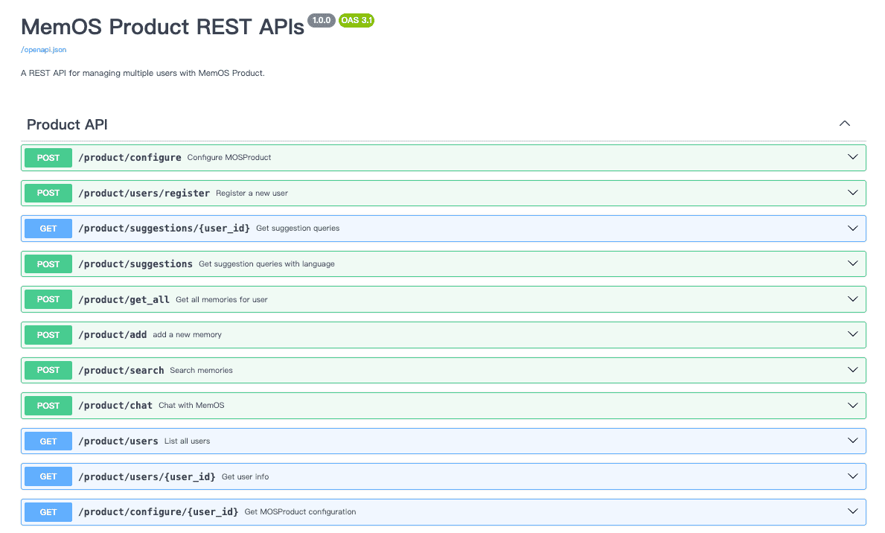

## 1. API Introduction

MemOS currently provides two types of APIs to help developers store and retrieve conversation memory:

- **Memory API**: Retrieves relevant memory fragments of the user so that model-generated responses can incorporate user history, preferences, and context;  
- **Message API**: Adds and retrieves raw conversation messages between the user and system, supporting storage of complete conversation records.

## 2. Authentication

All API requests require authentication. Ensure that each request includes your API key in the Authorization header.

## 3. Project Management

MemOS supports managing resources, permissions, and call logs at the project level. A project can be an app, an agent, or any module that requires independent resource management.

1. **Create Project**

- Each new user has a default project.  
- When creating a new project via the console, enter a name and description to create your independent project.

 

2. **Delete Project**

- If you have multiple projects, you can delete projects that are no longer needed.

::note
Deleting a project will erase all memories, messages, and related data under that project. This operation **cannot be undone**.
::

 

3. **API Keys**

- Each project has its own API key list for accessing all memories, messages, and data under that project.  
- Switch projects in the top-left corner of the console to view the corresponding keys.

 

4. **Call Logs**

- Switch projects in the top-left corner of the console to monitor API usage and history.

## 4. Next Steps

- Register and log in to the [MemOS Cloud Platform](https://memos-dashboard.openmem.net/quickstart/) to obtain your API key.  
- Review the detailed documentation for each API to understand request & response formats, parameters, and examples:  
  - [Add Message](/dashboard/api/add-message)  
  - [Search Memory](/dashboard/api/search-memory)  
  - [Get Message](/dashboard/api/get-message)  
  - [Error Codes](/dashboard/api/error_code)  
- Make your first API call to add or retrieve memory.

## 5. Contact Us

