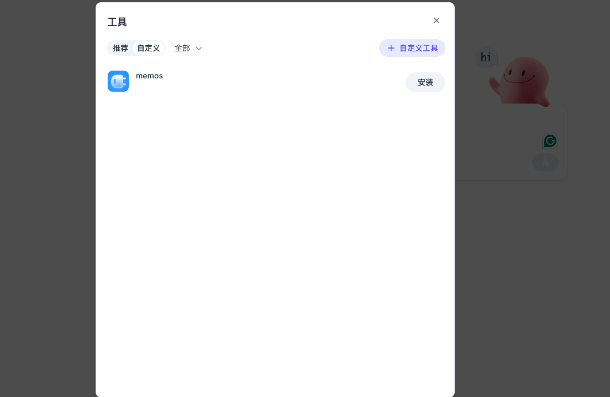

## 1. Free Quota

The MemOS Cloud Service currently provides all developers with the following free development quotas for the APIs, calculated based on **number of calls**. Different APIs consume quota differently, as shown in the table below:

| API Name | Consumption Type | Description | Free Quota (Calls) |
| --- | --- | --- | --- |
| addMessage | Number of calls | Each successful request consumes 1 call | 5,000 |
| searchMemory | Number of calls | Each successful request consumes 1 call | 1,000 |
| getMessage | Number of calls | Each successful request consumes 1 call | 5,000 |

::note
**Note**
- The free quota is provided per **developer account** and is shared across all projects under that account.
- Failed requests (authentication failure, parameter error, exceeding limits, etc.) **do not consume quota**.
::

## 2. Resource Limits

To ensure stable and secure service, MemOS Cloud Service enforces the following limits on API calls, calculated at the account level:

| API Name | Max Input per Request | Max Output per Request | Total Call Limit |
| --- | --- | --- | --- |
| addMessage | 4,000 tokens | - | 5,000 |
| searchMemory | 4,000 tokens | 10 memories | 1,000 |
| getMessage | - | 50 messages | 5,000 |

::note
**Note**
- Requests exceeding the per-call limit will return the corresponding error code without deducting quota.
- Additionally, we recommend a maximum QPS ≤ 10 (i.e., up to 10 requests per second). This is not a strict limit, but high concurrency may be affected by platform capacity, so control request frequency according to actual needs.
::

## 3. Usage Monitoring

You can view the remaining quota for each API through the **API Console**, with filters for project, API key, and date to facilitate tracking and managing usage.

## 4. Obtaining More Quota

To help developers quickly try and validate features while considering resource costs, each developer is provided a **limited free quota**. When usage exceeds the free quota, the system will block excess requests and provide a prompt, ensuring platform stability.

If you need more API calls, simply scan the QR code below with your personal WeChat app (no need to install WeCom/Enterprise WeChat) to reach our support team and receive extra free quota.
Not using WeChat? Scan the Discord QR code in the Contact Us section below to join our channel and get additional quota.

## 5. Contact Us

