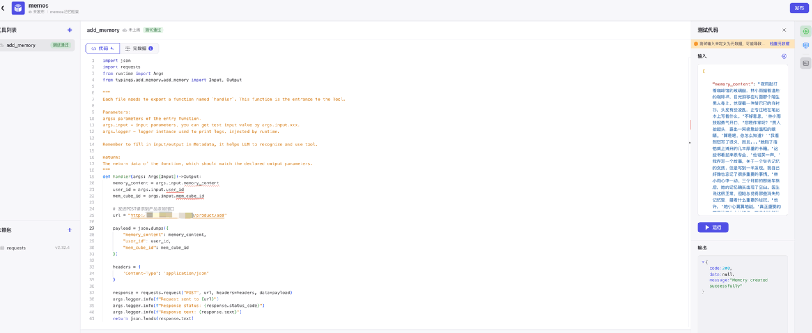
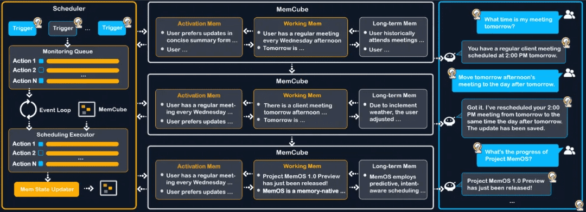
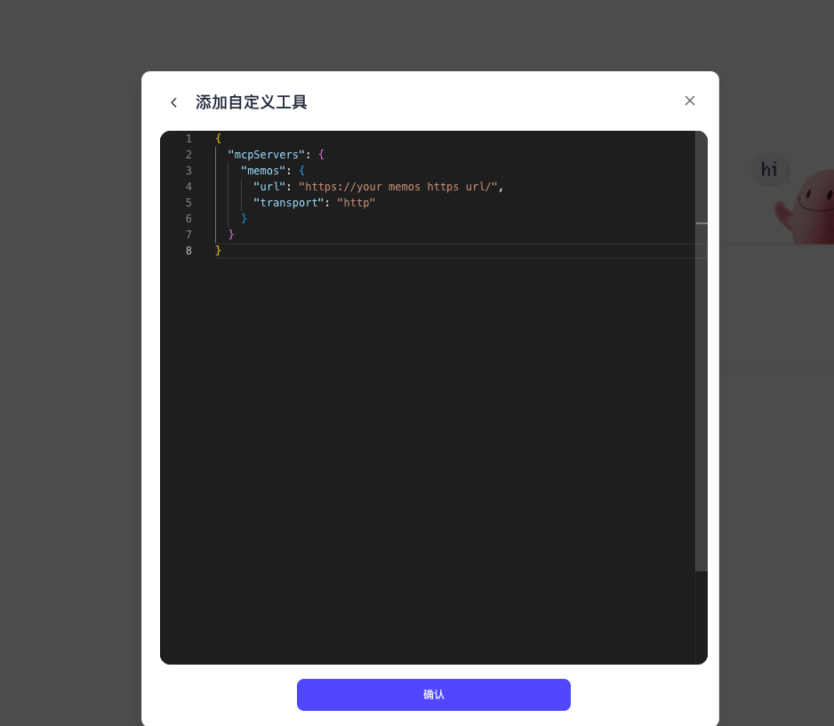

::note 
Reference: Paper link https://arxiv.org/abs/2507.03724
::

## 1. What is MemOS?

Today’s large language models (LLMs) have demonstrated strong generative and reasoning capabilities, but they generally lack true “memory.”

*   In multi-turn conversations, they often forget earlier information;
    
*   In application scenarios, they fail to retain users’ personalized preferences;
    
*   During knowledge iteration, they update slowly and cannot flexibly adapt to new requirements.

This makes LLMs “smart,” but not yet capable of becoming true **teachers, colleagues, or assistants**.

 

**MemOS (Memory Operating System)** was created to address this fundamental gap.  
It elevates “memory” from a fragmented function to a **system resource** as important as computation, providing LLMs with:

*   **A unified memory layer**: supporting long-term knowledge retention and context management beyond single conversations;
    
*   **Persistence and structuring**: enabling memory to be stored, traced, and reused;
    
*   **Memory-augmented reasoning**: recalling historical experiences and preferences during inference to generate answers better aligned with user needs.
    

 

Compared with traditional approaches (e.g., purely relying on parameter memory or temporary KV cache), the value of MemOS lies in:

*   Allowing AI to continuously evolve and learn instead of “forgetting after seeing”;
    
*   Not only answering the present question, but also improving future performance through accumulated knowledge;
    
*   Providing developers with unified APIs that turn “memory” from complex self-built logic into standardized capabilities.
    

 

In short, MemOS aims to:  
**Transform large models from disposable dialogue tools into intelligent agents with true long-term memory and adaptive capabilities.**

## 2. MemOS Architecture Design

At its core, MemOS treats “memory” as an independent system layer—like computation and storage—becoming a fundamental capability for AI applications.  
Its overall architecture can be summarized as a **three-layer structure**: **API & Application Interface Layer, Memory Scheduling & Management Layer, Memory Storage & Infrastructure Layer**

*   In the **API & Application Interface Layer**, MemOS provides standardized Memory APIs. Developers can perform operations such as **memory creation, deletion, and updating** through simple interfaces, giving large models persistent memory capabilities for multi-turn conversations, long-term tasks, and cross-session personalization.
    

> Here, the `API layer` refers to standardized interface design within the framework, illustrating system principles and capability boundaries. **<u>This is different from cloud service developer APIs</u>**  (e.g., simplified wrappers like `add`, `search`), which serve as unified endpoints abstracted from MemOS backend capabilities.

 

*   In the Memory Scheduling & Management Layer, MemOS introduces a new paradigm of **Memory Scheduling**, enabling context-based **“Next-Scene Prediction”**. This allows memory fragments likely to be needed to be preloaded during generation, significantly reducing response latency and improving inference efficiency.

    
 

*   In the **Memory Storage & Infrastructure Layer**, MemOS integrates plaintext memory, activating memory, and parameter memory through the standardized **MemCube**. It supports multiple persistent storage methods, including graph databases and vector databases, and offers **cross-model memory transfer and reuse**.
    

<figure style="width: fit-content">
  
  <figcaption style="text-align: center;">Basic structure of standardized MemCube (Memory Cube)</figcaption>
</figure>

## 3. Why is MemOS Efficient?

:::note{icon="ri:message-2-line"}
From Next-Token Prediction to Next-Scene Prediction
:::

*   In traditional LLM Q&A systems, the generation process still follows the **synchronous Next-Token mechanism**: the model receives the user’s query → retrieves external fragments in real time → generates the answer token by token.
    
*   Any pauses caused by retrieval or computation directly extend the reasoning chain, tightly coupling knowledge injection and generation. This leads to GPU idle waiting and noticeable response delays for users.
    
*   Unlike this traditional paradigm, MemOS approaches from the perspective of memory modeling and introduces a **memory scheduling paradigm**. By designing an asynchronous scheduling framework, it predicts memory information likely to be needed, significantly reducing efficiency loss during real-time generation.
    
*   MemOS jointly schedules the three core memory types in MemCube (parameter memory, activating memory, plaintext memory) along with external knowledge bases (including internet retrieval and massive local knowledge).
    
*   With precise awareness of conversation turns and time gaps, the system intelligently predicts which memory elements may be needed in the next scene. It dynamically routes and preloads the required plaintext, parameter, and activating memories, ensuring immediate hits during generation and maximizing efficiency and fluency of reasoning.
    

<figure style="width: fit-content">
  
  <figcaption style="text-align: center;">Core idea of memory scheduling</figcaption>
</figure>

## 4. MemOS-Preview Performance Evaluation

### 4.1 LoCoMo Memory Benchmark

*   To systematically validate MemOS in real application scenarios, the MemOS team conducted comprehensive evaluations using the **LoCoMo dataset**.
    
*   As an industry-recognized benchmark for memory management, LoCoMo has been adopted by multiple mainstream frameworks to test models’ memory access and multi-turn dialogue consistency.
    
*   Public results show that **MemOS achieves significant improvements in both accuracy and computational efficiency**. Compared with OpenAI’s global memory approach, it demonstrates superior performance on key metrics, further verifying its technological leadership in memory scheduling, management, and reasoning integration.
    

### 4.2 KV Cache Memory Evaluation

*   Beyond general memory ability assessments, the research team specifically examined the effectiveness of MemOS’s KV Cache mechanism in accelerating inference.
    
*   Tests were conducted across different context lengths (Short/Medium/Long) and model sizes (8B/32B/72B), systematically evaluating cache build time (Build), **Time-To-First-Token (TTFT), and overall Speedup**.
    
*   Results (see Figure 10) show that **MemOS significantly optimizes KV Cache build and reuse efficiency across configurations**, making inference more efficient and smooth. This reduces user waiting latency and achieves substantial performance acceleration in large-scale model scenarios.
    

## 5. Next Steps

*   Try our cloud service to experience the power of MemOS [《Cloud Platform Overview》](/dashboard/overview)
    
*   Or deploy and explore with the MemOS open-source project [《Open-Source Project Overview》](/open_source/home/overview)
    

## 6. Contact Us

