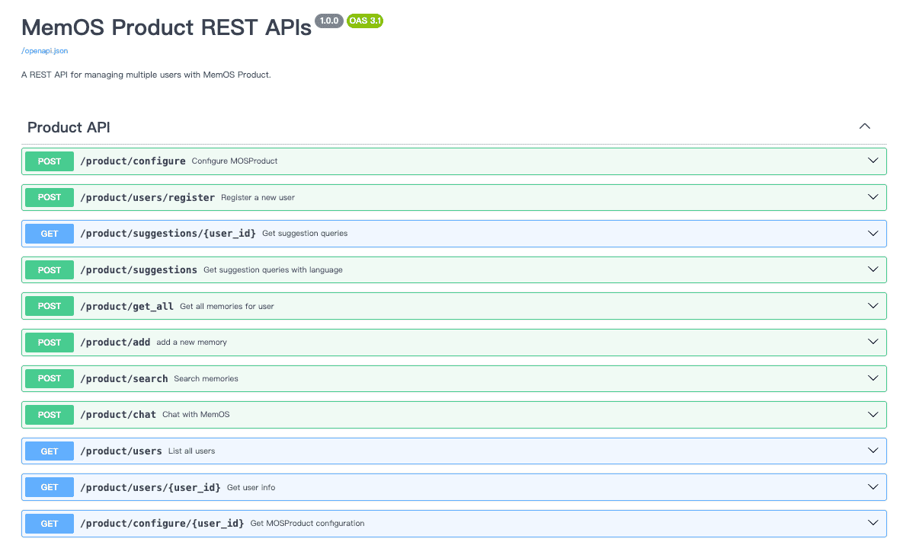

## 1. Frequently Asked Questions

### Q: What is the difference between MemOS and a standard RAG framework?

| **Comparison Dimension** | **RAG** | **MemOS** | **Advantages of MemOS** |
| --- | --- | --- | --- |
| Accuracy | The more corpus, the more noise | Extracted and modeled during the production stage, structured through schematization/relational modeling, combined with scheduling and lifecycle management, resulting in more organized memories  Capable of self-evolution driven by user feedback | **More Accurate**: Less noise, fewer hallucinations |
| Result Organization | Directly returns raw text paragraphs, redundant content | Processes raw information into memories, distilled into units like facts/preferences, shorter and purer | **More Efficient**: Fewer tokens for the same information |
| Search Scope | Always searches the entire corpus, slower with larger data | Memories dynamically update, managed in layers, recalled progressively | **Faster**: Avoids global scan, hits within smaller ranges |
| Understanding | Cannot accumulate preferences from user history (no personalization), relies only on similarity matching with static knowledge base | Automatically extracts preferences into memories, transforms them into executable instructions during recall, enabling the model to truly understand | **More Understanding**: Responses closer to real needs |

### Q: Can MemOS be combined with existing RAG or knowledge graphs?

Yes. MemOS memory units can interface with the vector recall layer of RAG or call external knowledge graphs. The difference is that MemOS manages dynamic, evolving “memories,” not a static knowledge base.

### Q: How does MemOS work?

Our cloud service platform provides two core interfaces:

`addMessage` — Submit raw information (user-AI conversations, user action logs/traces within the app, etc.) to us, and we automatically process and store it as memories.

`searchMemory` — Recall relevant memories in subsequent conversations and optionally complete instruction assembly, making AI responses closer to user needs.

### Q: What are the core functions of MemOS?

*   **User/Agent Memory Management**: Supports long-term preservation of user-AI interactions, with the ability to share or isolate memories across multi-agent collaboration, ensuring task continuity.
    
*   **Dynamic Layered Scheduling**: Unlike static RAG, MemOS dynamically switches between activating memory and plaintext memory based on task priorities, avoiding global scanning and enabling faster, more accurate calls.
    
*   **Personalized Preference Modeling**: Automatically extracts user preferences from historical interactions and supplements instructions in real time, making outputs closer to user habits.
    
*   **Memory Lifecycle Governance**: Prevents memory inflation through merging, compression, and archiving mechanisms, maintaining an efficient and stable knowledge base in the long run.
    
*   **Developer-Friendly API**: Provides a unified interface that can call open-source frameworks or directly connect to cloud services with low integration costs.
    
*   **Cross-Platform Consistency**: Ensures consistent memory scheduling behavior and data formats, whether deployed locally or hosted in the cloud.
    
*   **Hosted Service Support**: Provides cloud hosting with built-in monitoring and elastic scaling, reducing operational costs.
    
*   **Cost Savings**: By processing memories and scheduling by priority, only necessary information is injected, saving tokens compared to directly appending raw text.
    

### Q: How to evaluate the ROI of using MemOS?

Typical metrics include: token consumption reduction (more efficient), improved output relevance (more accurate), increased user retention (more understanding), and knowledge solidification rate (how much is consolidated long-term).

### Q: How to further improve MemOS effectiveness in specific business scenarios?

You can contact us for commercial customization (fastest and best). Alternatively, since MemOS is open source, your team can dive in and modify it (though with higher learning costs and possible detours).

### Q: Does MemOS support on-premise deployment?
Yes.

### Q: What is the relationship between lifecycle and scheduling?
The lifecycle manages “state transitions of memory units,” while scheduling is responsible for “selecting the right memory units at any moment and feeding them into the model.” They complement each other but are not equivalent.

### Q: How does MemOS avoid memory inflation?
Through merging, compression, and archiving: low-value memories are down-ranked, high-value memories are merged or solidified. This ensures storage and inference remain efficient.

 

**Q: Are KV-Cache and activating memory the same thing?**  
No. KV-Cache is the underlying computational implementation, while activating memory is a business-level concept. Currently, activating memory mainly relies on KV-Cache, but other implementations may emerge in the future.

### Q: Will MemOS slow down inference?
No. The scheduler runs asynchronously and adopts cache stability strategies to balance memory updates with calls. In practice, latency increases are usually within an acceptable range.

### Q: If the requested information is very recent, like “what I did yesterday,” is scheduling still needed?
Yes. Scheduling is not only about “retrievability” but also about being “fast, accurate, and concise.” Even with recent events, the scheduler still evaluates whether to fuse them into a complete context.

## 2. Next Steps

*   Start using our cloud service to experience the power of MemOS [Cloud Platform Overview](/dashboard/overview)
    
*   For a deeper understanding of MemOS algorithms, see [Overview of MemOS Algorithm Principles](/overview/algorithm)

## 3. Contact Us

