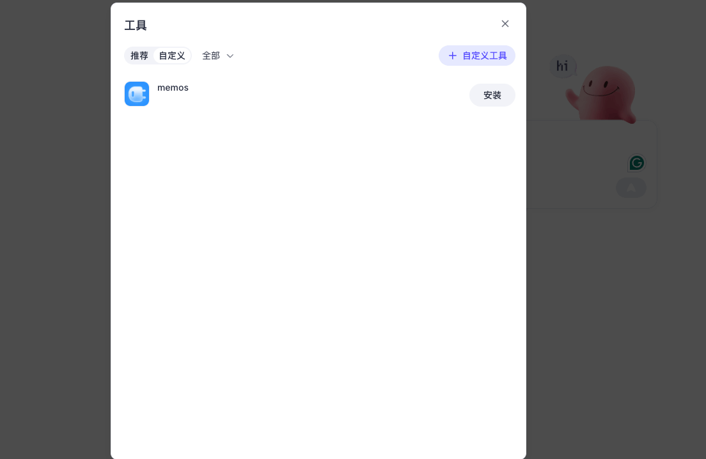

::note
**Tip**<br> Before writing the first line of code, you can quickly experience the effect of “memory capability” through **MemOS Playground**.<br>

* **No installation required**: Simply open in the browser to use<br>

* **Real interaction**: Chat just like with a normal Chatbot, but the system will automatically remember what you said<br>

* **Visualized memory**: You can see which content has been processed into memory, and how it is scheduled and recalled<br>

👉 [Try Playground now](https://memos-playground.openmem.net/)
::

MemOS provides two usage options:

1. **Cloud Service Platform** — the fastest way to get started, only requires an API Key.  
2. **Open-source Framework** — for local/private deployment, convenient for secondary development and deep integration.  

> Whether **Cloud Service** or **Open-source Framework**, MemOS enables your AI to **easily obtain persistent memory**.<br>You can start with the cloud service for a quick experience, then switch to localized deployment as needed.

---
## 1. Option One: Cloud Service Platform

When building applications with large models, a common problem is: **How can AI remember users’ long-term preferences?**  
MemOS provides two core APIs to help you achieve this:

- `addMessage` — Submit raw conversations to us, we automatically process and store them as memory  
- `searchMemory` — Recall relevant memories and optional suggested instructions in subsequent conversations, making AI responses more aligned with user needs  


### Step 1. Get API Key

Register an account on the [MemOS Cloud Platform](https://memos-dashboard.openmem.net/quickstart) to obtain the default API Key.

### Step 2. Store raw conversations (addMessage)

::note
**Conversation A: occurred on 2025-06-10**<br>

You only need to provide the `raw conversation logs` to MemOS, and MemOS will `automatically abstract, process, and save them as memory`.
::

```python
import os
import requests
import json

os.environ["MEMOS_API_KEY"] = "YOUR_API_KEY"
os.environ["MEMOS_BASE_URL"] = "https://memos.memtensor.cn/api/openmem/v1"

data = {
  "messages": [
    {"role": "user", "content": "I want to travel during summer vacation, can you recommend something?"},
    {"role": "assistant", "content": "Sure! Are you traveling alone or with family/friends?"},
    {"role": "user", "content": "Of course I’m bringing my kid, our family always travels together."},
    {"role": "assistant", "content": "Got it, so you’re traveling with your children as a family, right?"},
    {"role": "user", "content": "Yes, with both kids and elderly, we usually travel as a whole family."},
    {"role": "assistant", "content": "Understood, I’ll recommend destinations suitable for family trips."}
  ],
  "user_id": "memos_user_123",
  "conversation_id": "0610"
}

headers = {
  "Content-Type": "application/json",
  "Authorization": f"Token {os.environ['MEMOS_API_KEY']}"
}

url = f"{os.environ['MEMOS_BASE_URL']}/add/message"

res = requests.post(url=url, headers=headers, data=json.dumps(data))

print(res.json())
```

### Step 3. Query MemOS for relevant memories within conversations (searchMemory)

::note
**Conversation B: occurred on 2025-09-28**<br>

In a new conversation, when the user asks AI to recommend a National Day trip plan, MemOS automatically recalls relevant memories for AI reference, enabling more personalized recommendations.
::

> MemOS supports returning **`related memories (matches)`**, **`stitched instructions (instruction)` (coming soon)**, and **`full instructions (full_instruction)` (coming soon)** simultaneously. In practice, you only need to choose one based on your business needs.

> - **Need full control** → use **matches**, only returns memory items, developers manually stitch them into instructions;  
> - **Want to save stitching work, but still need to add business rules** → use **instruction**, system has combined memories and user query into semi-finished instructions, developers can further refine them;  
> - **Pursue one-click direct use** → use **full_instruction**, system has generated complete terminal instructions ready to be sent to the model.

> **Why this design**: Most memory systems stop at “recalling facts”, but facts ≠ executable Prompts. MemOS’s unique instruction completion chain saves you from complex stitching and fine-tuning, directly converting memories into model-readable and executable prompts.

```python
import os
import requests
import json

os.environ["MEMOS_API_KEY"] = "YOUR_API_KEY"
os.environ["MEMOS_BASE_URL"] = "https://memos.memtensor.cn/api/openmem/v1"

data = {
    "user_id": "memos_user_123",  
    "conversation_id": "0928",
    "query": "Where to go for National Day travel?",
    "memory_limit_number": 6  # Optional, default is 6 if not provided

    # ==== Coming Soon ====
    # The following parameters will be supported in future versions, please do not pass them now
    # "return_matches": True,
    # "return_instruction": True,
    # "return_full_instruction": True
}

headers = {
  "Content-Type": "application/json",
  "Authorization": f"Token {os.environ['MEMOS_API_KEY']}"
}
url = f"{os.environ['MEMOS_BASE_URL']}/search/memory"

res = requests.post(url=url, headers=headers, data=json.dumps(data))

results = res.json()  

# Mode 1: Related Memories (matches)
print("Related Memories:", results["data"]["memory_detail_list"])
# Example output(simplified here for easier understanding, for reference only):
# [
#   {
#     "memory_key": "Travel Habit",
#     "memory_value": "Travel with whole family (including kids and elderly)",
#     "confidence": 0.97,
#     "update_time": "2025-06-10T10:00:00Z"
#   }
# ]

# Mode 2 (coming soon): Stitched Instruction (semi-finished, structured, easy for further processing)
# print("Instruction:", results["data"]["instruction"])
# Example output:
# Task: Answer user’s “Where to go for National Day travel?”
# Audience: Family trip (including kids and elderly)
# Requirements:
# - Explicitly consider the needs of children and elderly in the response
# - Destination suggestions must align with “family-friendly”
# Notes: If key information is missing (departure, budget, duration), add clarification strategies via business logic

# Mode 3 (coming soon): Full Instruction (terminal form, can be directly sent to model)
# print("Full Instruction:", results["data"]["full_instruction"])
# Example output:
# You are a travel consultant.
# The user always travels with their whole family (including kids and elderly).
# Directly answer “Where to go for National Day travel?” and prioritize family-friendly destinations.
# If information is insufficient, first ask clarification questions before giving suggestions.
```

## 2. Option Two: Open-source Framework

For local deployment or deep customization, you can directly use MemOS’s open-source framework. Compared with cloud services, the open-source framework has no extra abstraction layer. Developers need to explicitly handle **memory extraction, storage, and retrieval**, all of which operate on a **MemCube**.

> MemCube is the basic container of memory, responsible for storing user memory items. The `addMessage` and `searchMemory` APIs in the cloud service are essentially abstracted wrappers around internal operations of MemCube. In the open-source framework, developers can directly control these steps.

For detailed operation steps, see: [Open-source Project → Quick Start](https://memos-docs.openmem.net/open_source/getting_started/quick_start)

## 3. Next Steps

### 3.1 Learn about MemOS Memory Production Process

Here we will explain in detail **how a message entering the system is processed into memory and effectively used in future conversations**, to help you better understand MemOS’s memory mechanism and advantages.

::note
**Deep Understanding**<br>
MemOS’s memory mechanism can be understood as a complete “workflow”:  
You submit raw messages → Processed into memory → Scheduling mechanism arranges invocation and storage based on task and context, and dynamically adjusts memory forms → Relevant memories are recalled when needed and injected as context or instructions → Lifecycle management ensures evolution and updates.
::

- [Memory Production](/overview/quick_start/mem_production)  
- [Memory Scheduling](/overview/quick_start/mem_schedule)  
- [Memory Recall & Instruction Completion](/overview/quick_start/mem_recall)  
- [Memory Lifecycle Management](/overview/quick_start/mem_lifecycle)  

### 3.2 Practice with MemOS

We provide three concrete business reference cases for you to review:

- [Help financial assistant understand client preferences behind behaviors](/usecase/financial_assistant)  
  - In intelligent investment advisory, user clicks, browsing, bookmarks, and communication all form behavioral traces for profiling.  
  - MemOS can abstract these behaviors into memories, e.g. “Risk preference = Conservative”.  
  - When the user asks “What kind of investment suits me?”, the assistant can directly leverage them to provide more professional and personalized advice.  

- [Build a family life assistant with memory](/usecase/home_assistant)  
  - A family assistant doesn’t just answer immediate questions, it also remembers your to-dos, preferences, and family information.  
  - For example: “Take kids to the zoo on Saturday” or “Remind me by listing key points first”, MemOS converts these into memories.  
  - In later conversations, they automatically take effect, making the assistant closer to real life.  

- [A writing assistant with memory is more useful](/usecase/writting_assistant)  
  - A writing assistant should not only generate content but also maintain consistent tone and style.  
  - With MemOS, user writing preferences, frequently used information, and contextual instructions can all be remembered.  
  - Next time, when writing a summary or email, no need to repeat reminders—achieve coherent and personalized writing experience.  

## 4. Contact Us


