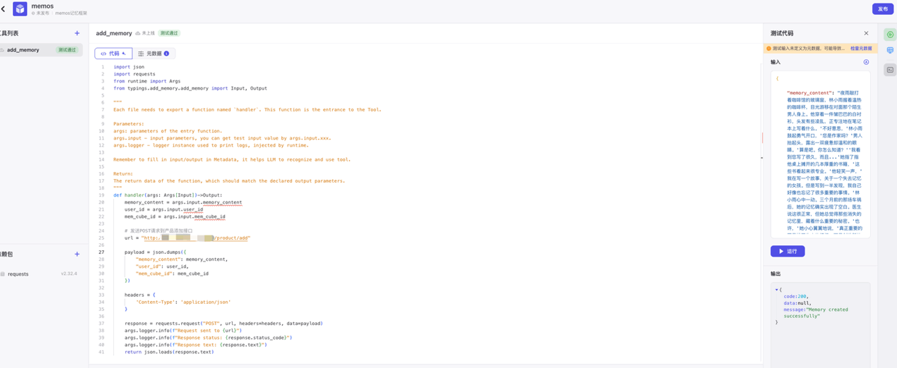

# Configuring Memos MCP and Tool Plugins in Coze Space
 [
[This guide will help you configure MemOS MCP services and create custom tool plugins in Coze Space, enabling seamless integration between intelligent agents and memory systems.]

## Coze Space MCP Configuration
 [
### Start MCP Module

[First, you need to start the MCP module and map the domain to HTTPS (you need to apply and configure this yourself):]

```
python examples/mem_mcp/simple_fast_mcp_serve.py --transport http

``` **HTTPS Requirement**
 Note that you need to configure the HTTPS address yourself. Coze Space requires secure connections. ### Open Coze Space and Configure Tools

1. [Open Coze Space and navigate to the tool configuration page]

[[ [ ]]]

### Add Custom Tools

[Add custom tools in the tool configuration page:]

[[ [ ]]]

### Configure MCP and Add Tools

[Configure MCP connection and add required tool functionalities:]

[[ [ ]]] **HTTPS Configuration Reminder**
 Please ensure you use the correct HTTPS address during configuration. Users need to configure HTTPS routing themselves.
## Custom Coze Tools

[For users who need to deploy HTTP services on their own servers, you can directly use Coze's IDE to create custom tools. Here's an example using `add_memory`:]
 [
### Start MemOS Service

[First, start the MemOS API service:]

```
python /MemOS/src/memos/api/product_api.py --port 9002

```

### Configure Tool Plugin in Coze

1. [Select IDE plugin creation method]
2. [Configure requests to your deployed HTTP service]

[[ [ ]]]

### Configure add_memory Operation

[Configure the `add_memory` operation in Coze IDE and publish:]

[[ [ ]]]

[Detailed code as follows:]

```
import json
import requests
from runtime import Args
from typings.add_memory.add_memory import Input, Output

def handler(args: Args[Input])->Output:
 memory_content = args.input.memory_content
 user_id = args.input.user_id
 mem_cube_id = args.input.mem_cube_id
 # Send POST request to product add interface
 url = "http://xxxxxxxxxx/product/add"
 payload = json.dumps({
 "memory_content": memory_content,
 "user_id": user_id,
 "mem_cube_id": mem_cube_id
 })
 headers = {
 'Content-Type': 'application/json'
 }
 response = requests.request("POST", url, headers=headers, data=payload)
 return json.loads(response.text)

``` **IDE Configuration**
 In the IDE, you can customize tool parameters, return value formats, etc., ensuring consistency with MemOS API interfaces. Use this method to complete the writing of search interfaces and user registration interfaces, then click publish. ### Publish and Use Plugin

[After publishing, you can view the plugin in "My Resources" and integrate it into intelligent agent workflows as a plugin:]

[[ [ ]]]

### Build Agent and Test

[After building the simplest intelligent agent, you can perform memory operation tests:]

1. [Create a new intelligent agent]
2. [Add the published memory plugin]
3. [Configure workflow]
4. [Test memory storage and retrieval functions]

[Through the above configuration, you can successfully integrate MemOS memory functionality in Coze Space, providing powerful memory capabilities for your intelligent agents.]
