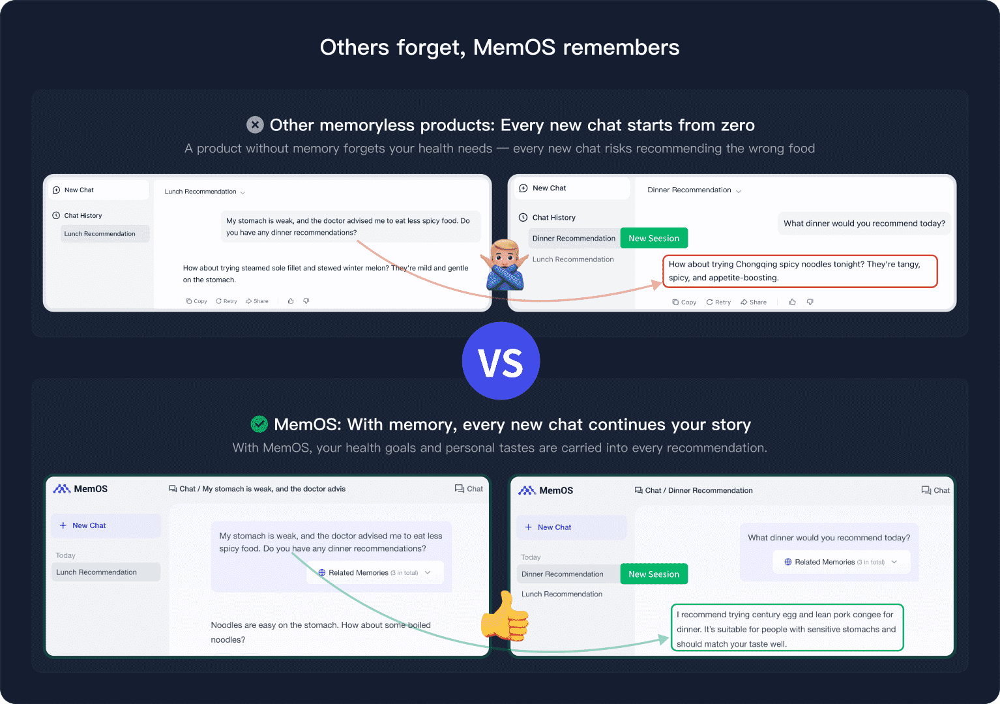
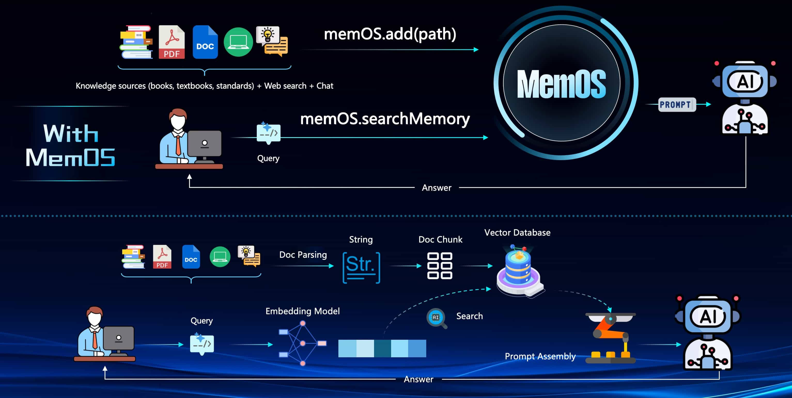

# MemOS Introduction
 [ MemOS (Memory Operating System) is a memory management operating system designed for AI applications. 
[Its goal is: to enable your AI system to **have long-term memory like a human**, not only remembering what users have said but also actively invoking, updating, and scheduling these memories.]
 
[For developers, MemOS is like a database for applications: you don’t need to reinvent the wheel to solve the problem of “how AI remembers.” By simply calling the services provided by MemOS, you can easily equip your Agent or application with “memory capability.”]  ## 1. Why MemOS is Needed
 
[Native memory in large models has limitations:]
 
- [**Limited context**: No matter how large the token window is, it cannot carry long-term knowledge.]
- [**Severe forgetting**: Preferences mentioned by the user last week may disappear in the next conversation.]
- [**Difficult to manage**: As interactions increase, memories become chaotic, requiring extra logic for developers to handle.]
 
[The value of MemOS lies in its ability to **abstract the memory layer**, allowing you to focus only on business logic:]
 
- [No more writing complex “long text concatenations” or “extra database queries.”]
- [Memory can be reused and extended like a module, and even shared across different Agents and systems.]
- [With proactive scheduling and multi-layer management, memory retrieval is faster and more accurate, significantly reducing hallucinations.]
 
[In short: **MemOS transforms AI from a one-off conversation machine into a continuously growing partner.**]  ## 2. What MemOS Can Do
 
- [**Personalized conversations**: Remember the user’s name, habits, interests, and instruction preferences, and automatically supplement them next time.]
- [**Team knowledge base**: Convert fragmented conversations into structured knowledge for multiple Agents to collaborate.]
- [**Task continuity**: Maintain memory across sessions and applications, enabling AI to handle long workflows with ease.]
- [**Multi-layer memory scheduling**: Invoke the most suitable memory for different needs, improving performance and accuracy.]
- [**Open extensibility**: Can be used as a standalone API or integrated into existing frameworks (official integration guide coming soon).]
 
 
## 3. Next Steps
 
[👉 Go to [Quick Start](/overview/quick_start/overview) for a minimal example showing how to equip your Agent with “memory capability.”]
 
[👉 Or start directly developing business applications. We provide a few sample cases for reference: [Help a financial assistant understand client preferences behind behaviors](/usecase/financial_assistant), [A writing assistant is better with memory](/usecase/writting_assistant), [Build a home assistant with memory](/usecase/home_assistant)]
